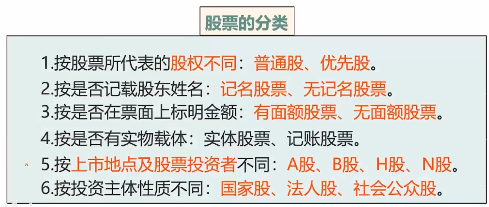

# 1、经济基础知识

## 1.1、宏观经济分析

- **经济增长**的衡量指标是**国内生产总值**
  - 经济增长：一个特定时期内一国(或地区)**经济产出**和**居民收入**的增长
  - 国内生产总值：GDP指在**一国**领土范围，本国居民和外国居民在一定时期内所生产的、以市场价格表示的产品和劳务**总值**
    - 居住在本国的公民
    - 暂居外国的本国公民
    - 长期居住在本国但未加入本国国籍的居民(一年+)
- **充分就业**的衡量指标是**失业率**
  - 失业率：**16岁+**的具有劳动力的人
  - 失业率是指**城镇失业率**
- **物价稳定**的衡量指标是**通货膨胀率**
  - 通货膨胀率：一般物价水平在一段时间内持续、普遍的上涨
  - 衡量通货膨胀常用指标有三种：
    - **消费者物价指数**：从消费者的角度去衡量一下这个商品的价格变化 consumer price index（CPI）
      - CPI 使用最多、最普遍
    - 生产者物价指数：从生产者的角度去衡量一下这个商品的价格变化 produce price index (PPI)
    - 国内生产总值平减指数：GDP跟之前的对比
- **国际收支平衡**的衡量指标是**国际收支**
  - 国际收支：一国居民在一定时期内与非本国居民在政治、经济、军事、文化及其他往来中所产生的全部交易的**系统记录**
  - ==其实也就是进口的钱和出口的钱是不是一个差额平衡==
  - 国际收支平衡表可分为三类：
    - **经常账户**：货物的运输等经常性的转移
    - **资本与金融账户**：大型债券的转移、大型的投资
    - **错误与遗漏账户**：认为设置的，用来协助平衡的
  - 巨额逆差：进口 >> 出口，说明我们要一直买东西，说明人民币不值钱，导致本国大量资本外流

### 1.1.1、经济周期的阶段

- 经济周期：**先强后弱再复苏**

### 1.1.2、金融危机的分类

- 货币危机：钱贬值
- 外债危机：欠钱太多还不上
- 银行危机：无法如期偿还债务
- 系统性金融危机：上三种一个个来的时候就会出现

### 1.1.3、经济结构

#### 1、产业结构

- 第一产业：原始的**农林牧渔** - 石器时代
- 第二产业：工业革命时代 - **制造业、采矿业、水电热燃、建筑业**
- 第三产业：现代

> 建筑业是第二产业，但是房地产是以盈利为目的的，是第三产业

#### 2、消费投资结构（GDP结构）

> - 私人购房属于投资，不是消费
> - GDP结构：又称为三结构，投资、消费、净出口

## 1.2、行业经济发展分析

### 1.2.1、行业的市场结构特征分析

| 类型     |                             特征                             |
| -------- | :----------------------------------------------------------: |
| 完全竞争 | **生产者众多，生产资料完全流动**； **产品同质、无差别**； 企业是价格的接受者、信息通畅 |
| 垄断竞争 | 生产者众多，生产资料可以流动; **产品同种不同质**； 企业对价格有一定的控制力 |
| 寡头垄断 |          少量的生产者在某种产品的生产中占据较大份额          |
| 完全垄断 |    只有一家企业生产唯一的产品，**企业对价格有很强控制力**    |

### 1.2.2、经济周期与行业分析

- 增长型行业：无论经济好不好，这个行业一直在增长
- 周期性行业：经济好，则行业好；经济不好，则行业不好
- 防守型行业：直接与经济无关，一直是这么多

| 比较项目   | 与经济周期的关系🔥                  | 产生原因                                             | 典型行业           |
| ---------- | ---------------------------------- | ---------------------------------------------------- | ------------------ |
| 增长型行业 | 与周期**无关**                     | 依靠**技术**进步、**新产品**的推出和更优质的**服务** | 计算机、技术       |
| 周期性行业 | 直接与**周期相关**                 | 需求收入弹性较高                                     | 消费品、耐用品制造 |
| 防守型行业 | **不受**经济周期处于衰退阶段的影响 | 产品需求相对**稳定**                                 | 食品业、公共事业   |

### 1.2.3、行业生命周期分析

初创期是起步、成长期是黄金发展、成熟期是巅峰、最后是衰退期，衰退期时期最长。

## 1.3、区域经济发展分析

### 1.3.1、区域发展条件分析

1. **自然条件和自然资源**是区域社会经济发展的**物质前提和物质基础**
2. 区域**劳动人口的数量**会影响区域**自然资源开发利用的规模**，区域**人口的素质**会影响**区域经济的发展水平和区域产业的构成状况**
3. **技术是构成区域生产力的重要组成部分**，科学技术条件是发展的重要条件之一。
4. 对区域基础设施的分析应**重点评价基础设施的种类、规模、水平、配套等对区域发展的影响**。

### 1.3.2、区域经济分析

对区域经济发展水平和发展阶段的分析：

- 在建立**经济发展水平量度标准**的基础上，通过**横向**比较，明确区域经济发展水平，确定其所处的发展阶段，为区域发展的战略决策提供依据。
  - 比如横向比较哪个城市最适合宜居等等，都是**横向**比较的，不是纵向

对区域产业结构和空间结构的分析：

- 通过各种**计量**方法分析比较产业结构和地域结构的合理性，为区域产业机构和空间结构的调整提供依据。

### 1.3.3、区域发展分析

在区域**自然条件**和**经济分析**的基础上，通过发展预测、结构优化和方案比较，确定区域发展的方向，并分析预测其实施效应。

- 分析内容：**经济、社会和生态环境**三个方面综合作为分析判断的标准
- 区域发展的核心：**经济发展**

# 2、金融基础知识

## 2.1、货币基础知识

### 2.1.1、货币的本质与职能

- 货币的产生历程：**简货搬货**（简货不好好学习，长大后去搬货物）
- 货币职能：甲流是只猪（价值、流通、世界、支付、贮藏）
  - 价值尺度：是观念形态的货币（**物品标价**）
  - 流通手段：（1）必须是现实的货币。（2）不需要具有十足价值，可以用符号代替
    - 微信支付、支付宝支付、信用卡支付，**一手交钱、一手交货**
  - 贮藏手段：（1）现实的、足值的货币。（2）退出流通领域处于静止状态
    - 例如用钱买了个古董
  - 支付手段：还款、上税、借款、发工资、捐款、赠予（**支付手段是单方面的**）
    - 口诀：公捐税租赔（工资、捐款、上税、租金、赔付）

### 2.2.2、货币需求与货币供给

影响货币需求的主要因素：

1. 收入水平：收入越高，花的越多，货币需求越高 
2. 利率水平：利率越高，钱存银行，货币需求越低
3. 信用制度的发达程度：信用越高，货币需求越低 
4. 汇率：汇率降低，人民币贬值，货币需求减少
5. 公众的预期和偏好：偏好越多，货币需求减少
6. 社会商品可供量、物价水平、货币流通速度（**M是货币的需求、P是物价价格Price、Q是商品数量Quality,V是货币流通速度Velocity**）

$$
M = PQ/V
$$

7. 其他因素（人口数量、人口密集成都、经济结构、社会分工、交通通信等技术状况）

货币按照**流动性**分为M0、M1、M2：

- M0：就是现金
- M1：现金 + 活期、信用卡、随时可以用的钱（又称为**狭义货币**或者**现实购买力**）
- M2：现在能用的钱M1 + 以后能用的钱（又称为**广义货币**或者**货币供应量**）
- M2 - M1 = **准货币，是潜在购买力**

## 2.2、存款货币创造过程及影响因素

### 2.2.1、存款货币创造过程

- **原始存款**：客户以现金存入银行形成的存款
- **存款准备金**：商业银行为保证客户提取存款和资金清算需要而准备的资金
- **派生存款**：银行用转账方式发放贷款、贴现和投资时创造的存款

讲个小故事：

1. 100元存入广发银行，按照法定存款准备金为10%，广发要给央妈上交10元，然后剩下的90元才能用来发放贷款和投资
2. 小明贷款90元存入中国银行，中行要给央妈上交9元，然后剩下的81元用来发放贷款和投资
3. 小张贷款81元存入工商银行，工行要给央妈上交8.1元，然后剩下的72.9元用来发放贷款和投资
4. **100元叫原始存款，在其他银行增加的90元、81元叫做派生存款**

$$
货币的总供应量 = 原始存款 + 派生存款
$$

$$
货币乘数K =(原始存款 + 派生存款) / 原始存款
$$

### 2.2.2、影响货币乘数K的因素

1. 法定存款准备金率：反比
2. 超额准备金率：反比
3. 定期存款的存款准备金率：反比

> 只要准备金率高了，那么各行给央妈的钱就多了，自己留下用来发放贷款的钱就少了，派生的钱就少了，那货币乘数K就少了

4. 现金漏损率：反比
   - 假如小明贷款了90元，花了10元，只存了80元。说明现金漏损率变大，则派生的钱也就少了，那货币乘数K就少了

> 与货币乘数K均成反比！

## 2.3、通货膨胀与通货紧缩

### 2.3.1、通货膨胀

- **通货膨胀**：钱太多了，人民币贬值，物价持续上涨的经济现象，货币的需求远远小于货币的供给，出现的原因有：
  - 需求拉上型通货膨胀：例如炒手机的的，用更多的货币追求过少的商品
  - 成本推动型通货膨胀：成本高了，卖价上升。工资推进、利润推进
  - 供求混合推动型通货膨胀
  - 结构型通货膨胀

通货膨胀的治理政策：

- 紧缩货币政策：**减少**货币供应量或者**提高**利率（人把钱都存银行）
- 紧缩财政政策：**增收**节支、**减少**赤字（增加税率、减少修建）

### 2.3.2、通货紧缩

- **通货紧缩**：钱太少了，货币的需求远远大于货币的供给，出现的原因有：
  - 货币的供给减少
  - 有效需求不足
  - 供需结构不合理
  - 国际时长的冲击

通货紧缩的治理政策：

- 引导公众预期
- 实行**扩张**的财政政策和货币政策
- 扩大有效需求：比如你装燃气给你补贴钱

> 通货紧缩就要扩

## 2.4、货币政策目标

- 央妈能够真实去操作的叫做**操作目标**，再实行一段时间的操作之后，达到的结果叫做**中介目标**，严防跑偏

### 2.4.1、央行三大法宝

#### 1、法定存款准备金

法定存款准备金：包括法定存款准备金（必须要上交的）以及超额存款准备金（自愿上交的）

央行法定存款准备金率上涨，则商行上缴法定存款准备金就多了，那么商行可直接运用的超额准备金就下降了，则商行对外贷款和投资的钱就下降，货币的供应量就下降了。

> 法定存款准备金和货币供应量是反向关系

#### 2、再贴现

先说明什么是贴现：假如你有100万的一张票据，六个月后才可以兑付，但是你三个月后就去广发银行兑付了，那么广发可以扣除5%的**贴现率**的费用，只能给你兑付95万。

再贴现：广发银行拿着这100万的票据，第四个月去找央妈兑付，央妈因为票据未到期限需要扣除6%的**再贴现率**的费用，只能给广发兑付94万。

概念：金融机构将未到期已贴现的商业汇票贴现给央行的行为。

央妈的再贴现率上涨，则商行被扣除的钱增多，那么商行向央行的融资成本增加，商行投资和对外放贷的钱就少了，那么货币供应量就少了，经济会下降。

> 货币供应量和再贴现率是反向关系。

 

#### 3、公开市场业务

央行公开向市场买卖证券的业务，目的是为了调控经济，而非盈利。

央行买入证券，相当于用钱买菜，在市场上投放了大量的资金，那么百姓手里的钱就多了，则货币供应量增加，钱多了不值钱，则市场利率会下降。

> 公开市场业务和再贴现率是正向关系。

# 3、金融市场

## 3.1、金融市场概述

- 概念：金融市场是指**货币资金融通**和**金融工具交易**的场所。大白话，就是利用货币资金进行流通、买卖、交易、转让促进经济循环

  - 例如买基金、买股票、买期货，用钱买金融工具，从而实现资金流通，个人买车、买房不属于融通。

  - 融通：有一个出钱的、有一个收钱的

    

- 融资方式：间接融资、直接融资。
  - 例如我借你100元，我是直接融资
  - 但是我向银行借100元，这100元可能是其他人存进去的，那么我和这个人就是间接融资

- 主体：金融市场的主体是各类融资活动的参与者，它们既是资金的供给者，也是资金的需求者。
  - 资金融通的主体就是收钱和出钱的，对应的就是资金的需求者和供给者。

- 客体：金融市场的**客体**是**金融交易对象**，金融市场的交易对象是货币资金。

### 3.1.1、金融市场的功能

1. 货币**资金融通**功能：是最主要和最基本的功能
2. **优化资源配置**功能：钱有逐利性，能够流向将它价值发挥到最大化的地方

3. 风险分散与风险管理功能
4. 经济调节功能
5. 交易及定价功能：买卖基金、股票有多家需求者和多家交易者，通过竞争来达到定价功能
6. **反映经济运行**的功能（**晴雨表**）

### 3.1.2、金融市场的种类

- 货币市场是短期金融市场，流通市场是长期金融市场，长期短期市场以一年为界限
- 发行市场也称为初级市场、一级市场，流通市场也称为二级市场、次级市场。（二手流通的感觉）
- 场内交易市场是交易所，比如证券交易市场、期货交易市场，银行属于场外交易市场

- 1、3、5、6是重点

### 3.1.3、金融工具的分类

按期限的长短划分：

- 短期金融工具
- 长期金融工具

按融资方式划分：

- 直接融资工具：股票、债券
- 间接融资工具：基金、保险、理财

按投资者所拥有的权力划分：

- 债权工具：债券
- 股权工具：股票
- 混合工具：可转换公司债券证券投资基金（了解）

## 3.2、货币市场和资本市场

### 3.2.1、货币市场

- **同业拆借市场**：同业拆借市场是银行等金融机构间的**短期资金**借贷市场。（银行和银行之间借钱，因为银行基本不会缺钱，基本第二天就还了，所以也叫隔夜拆借）
  - 期限较短，主要用于金融机构**临时性资金需要**。
  - 在无担保条件下进行的资金与信用的直接交换，潜在**信用风险较高**。
  - 形成的资金价格信号，反映了整个金融体系的资金供求状况和流动性状况，在货币政策传导和整个金融市场中起到**基础性作用**。
  - **交易风险小，信用风险高**

- **回购市场**：以回购方式进行债券交易其实是一种**有抵押**的贷款（典当）
  - 以短期融资为目的，通常在**一年**以内。
  - 以债券为抵押，风险较低，其标的物一般是**信用等级较高的政府债券**。
  - 债券回购以**大宗交易**为主。

- **票据市场**
  - 现代意义的商业票据与具体的**商品交易无关**，也不需要真实的商品交易为背景。
  - 商业票据以在货币市场上公开发行方式出售，票据面额、期限、利率不再因商品交易的具体条件而各不相同，**而是面额、期限、利率趋于整齐划一。**
  - 商业票据的性质属于本票，**发挥融资功能**，不再限于支付结算功能。

- 大额可转让定期存单市场CDs

- 定期存款：自己存3年活期等
- 大额可转让定期存单：买了这个存单，当需要钱时，可以将存单转给其他人，这样自己可以获得资金。

> 记忆定期存款

### 3.2.2、资本市场

#### 1、股票市场

- 按股票所代表的股权不同：普通股就是比如获得分红、在公司有一定话语权，优先股一般不外售，都是给重要的股东的，他们获得的钱很优先，所以一般不能参加股东大会。
- 按是否有实物载体：一张纸上面写了股票叫实体股票，没有纸而是电子记账的叫做记账股票。
- 境内上市的股票是A股和B股，境外上市的股票是H股和N股。境内购买的股票是A股和B股，境外购买的股票是H股和N股
  - A股是人名币普通股票，指的是在中国境内交易所所发行的，供境内投资者而购买的股票。
  - B股是人民币特种股票，指的是在中国境内证券交易所所发行的，供境外投资者而购买的股票。
  - H股是港股，指的是在香港上市发行，供境外投资者而购买的股票。
  - N股是纽约发行，供境外投资者而购买的股票。
  - B、H、N都是给境外投资者购买的，所以也叫外资股
- 1、2、6重要🔥

> 现实中买的股票都是普通股票，随着公司的发展而变化。
>
> 优先股是股息固定，不管以后公司发展如何，股息都是这么多。

> B、H、N都是给境外投资者购买的，所以也叫外资股
>
> 所有的外资股都是人民币标价、外币认购。

#### 2、债券市场

- 普通债券到期还本付息，附息债券定期支付利息，贴现债券100元的债券以90元的价格去发行，最终你需要以100元的价格还我，相当于差价10元就是利息了。
- 债券能否转换为股票。
- 给广泛的对象发行叫做公募债券，给特定对象，例如只给男人发行的叫做私募债券。

