# 1、个人存款业务

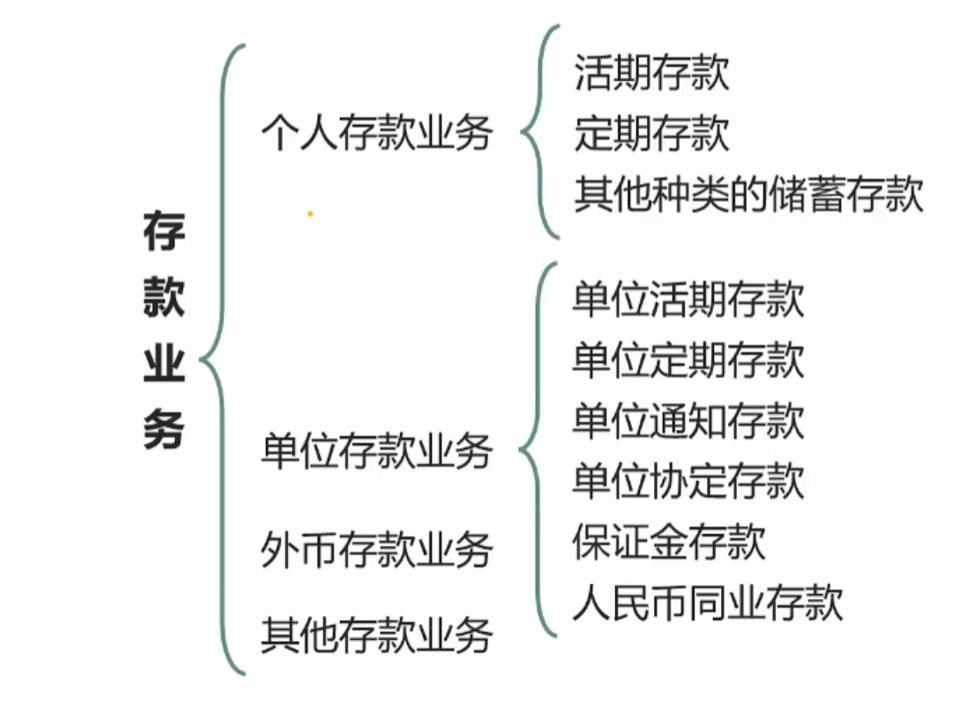

个人存款又称**储蓄存款**，是指居民个人将闲置不用的货币资金存入银行，并可以随时或按约定时间支取款项的一种信用行为，**是银行对存款人的负债。**

- 存款资源
- 取款自由
- 存款有息
- 为存款人保密

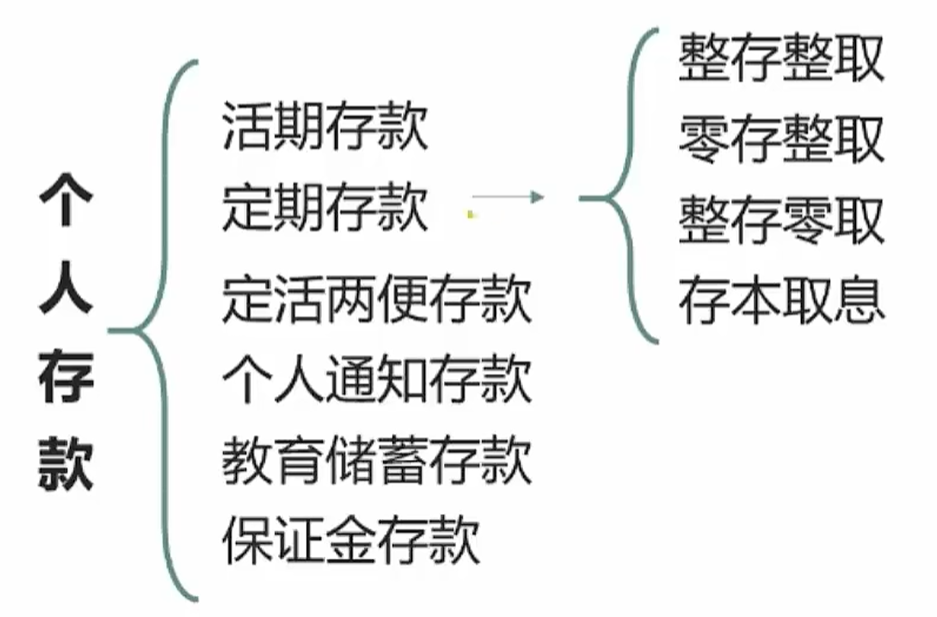

- 定活两便存款：存钱不约定时期，利率介于定期和活期之间
- 个人通知存款：存钱不约定时期，只是取钱的时候提前通知银行
- 教育储蓄存款：为子女所存的
- 保证金存款：居民出国的保证金存款 

## 1.1、活期存款

活期存款：通常1元起存，以存折或者银行卡作为存取凭证。

计息金额：

- **存款计息起点为元**，元以下角分不计利息
  - 单利计息法：只有本金计算利息。100元存利息，假如利息是10%，则一年后产生10元利息，账户有110元。第二年利息依然是10%，则第二年产生的利息依然是10元，并不是110×10%=11元。
  - 复利计息法（利滚利）：本金和利息一起加起来计算利息

- **活期存款计算复利**

结息时间：

- 自2005年9月21日起，活期存款**按季度结息**。
- **每季末的20日为结息日，21日付息**。
- 每季度末的20日算算要给你多少利息钱，21再给你钱。

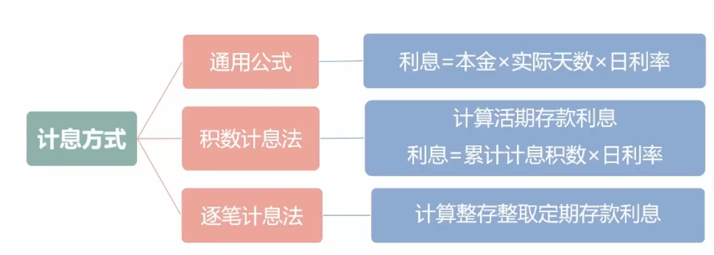

**通用公式**：100元存10天，日利率是5%，则利息 = 100×10×5%

银行给的都是年化利率，例如年华利率为2.3%，则日利率 = 2.3% ➗ 360

$$
日利率  = 年利率/360 

\\月利率 = 年利率/12
$$

**积数计息法**：对于**活期**不约定存款天数，比如我先存了100元，过了20天我又存了200元，又过了105天。则我的利息 = 100×20×日利率1 + 200×5×日利率2

**逐笔计息法**：对于定期，整存整取计算存款利息即可

## 1.2、定期存款

- 整存整取：50元起存。一次性存入，一次性全部取出
- 零存整取：5元起存。每过一点时间我存一点，之后一次性全部取出
- 整存零取：1000元起存。
- 存本取息：5000元起存

三种情况：

1. 我存了3w定期，存的时候利率是2%，一年后利率是3%，三年后利率是5%，我依然是按照当时存的2%计算利息，后续利息增长与否跟我无关
2. 我存了3w定期，存的时候利率是2%，一年后利率是3%，但是我想取1w出来，因为没到三年时间，我取这1w的利息就是：**1w × 一年 × 取钱当天的日利率** 
3. 我存了3w定期，存的时候利率是2%，一年后利率是3%，三年后利率是5%，三年零两个月后我才去取钱，**那么多存了这两个月的利息是按照活期复利来计算的**

- 存款利率：**期限越长，利率越高**
- 到期支取：按约定期限和约定利率计付利息
- 逾期支取：超过部分，除约定自动转存外，**按支取日挂牌公告的活期存款利率计付利息**，并全部计入本金。
- 提前支取：提前支取部分的利息同本金一并支取，**以活期计息**。
- 遇到利率调整：**仍然按照存单开户日挂牌公告**的相应定期存款利率计息。

## 1.3、其他种类储蓄存款

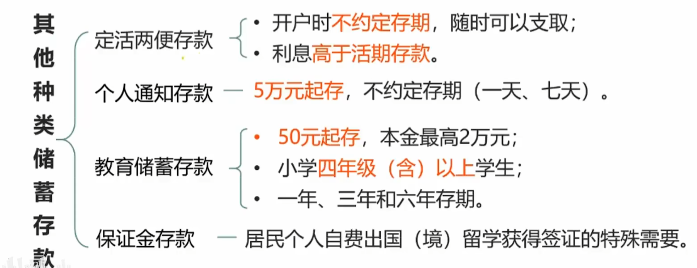

# 2、个人贷款业务

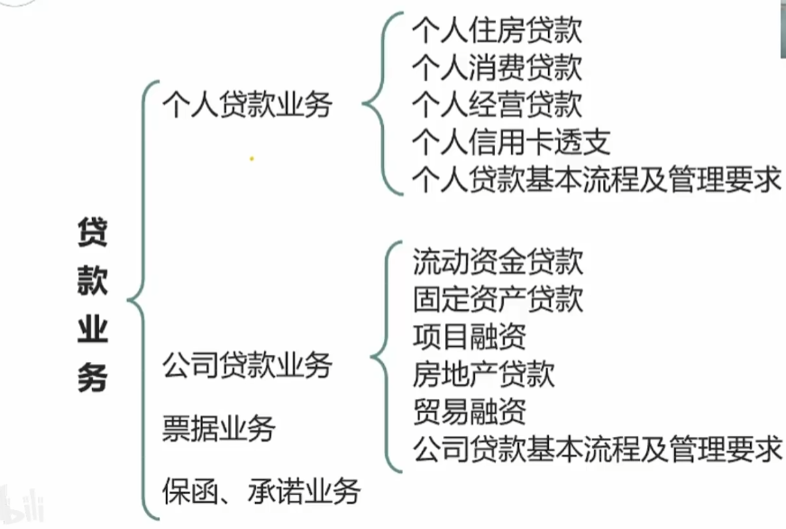

## 2.1、个人贷款业务的种类

个人住房贷款包含：

- **个人住房按揭贷款**
- 二手房贷款
- **公积金个人住房贷款**
- **个人住房组合贷款**
- 个人住房最高额抵押贷款
- 直客式个人住房贷款
- 固定利率个人住房贷款
- **个人商用房贷款**

个人消费贷款包含：

- 个人骑车贷款
- 助学贷款
- 个人消费额度贷款
- 个人住房装修贷款
- 个人耐用品消费品贷款
- 个人权利质押贷款

个人经营贷款包含：

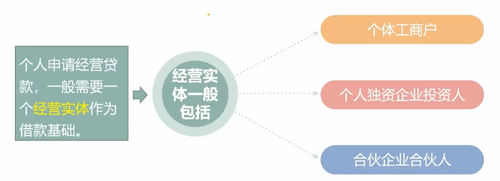

## 2.2、个人贷款还款方式

包含：

- **等额本息**：在每个还款期当中还款金额是固定的，对银行有利
- **等额本金**：先还的是利息，对个人有利，只是前期还款压力大
- 按周还本付息
- 递增还款法
- 递减还款法
- 先息后本法
- 组合还款法
- 到期一次还本付息法

## 2.3、个人贷款相关监管要求

- 遵循"**了解你的客户**"原则：起码得知道你贷款有没有还的能力吧，得熟悉客户
- 不得发放"**首付贷**"和首付不合规的个人住房贷款：假如首付30w，你向银行贷25w交首付，这个不能给你贷
- 各类消费贷款、个人经营性贷款、信用卡透支等不得用于购房

# 3、公司贷款业务🔥

## 3.1、公司贷款业务的种类

- 流动资金贷款
- 项目融资
- 贸易融资
- 固定资产贷款
- 房地产贷款

### 3.1.1、流动资金贷款

概念：商业银行向企（事）业法人或国家规定可以作为借款人的其他组织发放的用于借款人**日常经营周转**的**本外币**贷款。日常经营周转贷的一般不多，并且期限短。

- **禁止事项**：流动资金贷款不得用于**固定资产(期限长)、股权(风险大)**等投资，不得用于国家禁止生产、经营的领域和用途
- 申请条件：
  - 借款人依法设立、贷款用途明确合法
  - 借款人具有持续经营能力，有合法的还款来源
  - 借款人信用状况良好，无重大不良信用记录

### 3.1.2、固定资产贷款

概念:商业银行向企（事）业法人或国家规定可以作为借款人的其他组织发放的用于借款人**固定资产投资**的**本外币**贷款。

固定资产投资包括：

- 基本建设投资：比如扩产生产的投资
- 更新改造投资
- 房地产开发投资
- 其他固定资产投资

固定资金贷款按照用途可以分为：

- **基本建设贷款**
- **技术改造贷款**

单笔支付金额超过项目总投资**5%**或超过**500万**元人民币的贷款资金支付，采用商业银行受托支付。

- 自主支付：我贷款100万，银行给我100万，我拿着这100万去买房
- 受托支付：100万直接给房地产商，不经过我的手

### 3.1.3、项目融资

用于建造一个或一组**大型生产装置、基础设施、房地产项目或其他项目**，包括对在建或已建项目的再融资。

借款人：一般是为建设、经营该项目或为该项目融资负责而专门组建的企事业法人，包括主要从事该项目建设、经营或融资的既有**企事业法人**。

还款资金来源：该项目产生的**销售收入、补贴收入或其他收入**，一般不具备其他还款来源。

项目融资属于特殊的**固定资产贷款**。采用项目融资方式的项目通常都属于固定资产投资项目，所发放的贷款属于固定资产贷款。

### 3.1.4、房地产贷款

房地产贷款指与**房产或地产**的开发、经营、消费活动有关的贷款，是特殊的固定资产贷款。

房地产贷款分为两类：

1. 住房开发贷款
2. 商业用房开发贷款：非住宅部分投资占总投资比例超过**50%**的综合性房地产项目，贷款视为商业用房开发贷款。商用房贷款利率高

### 3.1.5、贸易融资

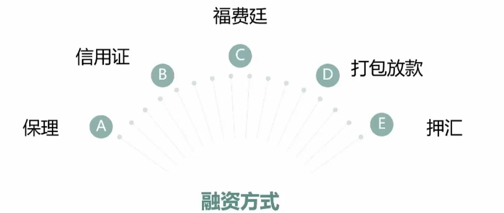

#### 1、保理

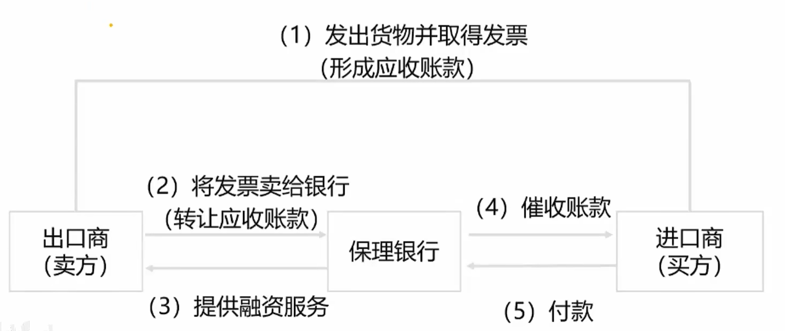

跨国交易过程中，卖方发出货物要取得发票，这个发票就是应收账款，应收账款是应该收但是对方还没有给，这个时候卖放可以把这个发票卖给银行，也就是转让应收账款，银行及时向卖方进行融资，之后由银行去向买方催收账款，买方给银行付款。所以保理就是银行充当中间人，卖家将风险转移给银行的操作。

- 有追索保理融资：应收账款付款方到期未付时，银行在追索应收账款付款方外，有权向保理融资申请人追索未付款项。
- 无追索保理融资：适用于真实贸易背景、合法形成应收账款的贸易企业。

> 有无追索也就是当买家不付款的时候，银行能不能从卖方处获得赔偿

#### 2、信用证

信用证是指**银行开立的有条件的付款承诺**，即开证行依照开证申请人的要求和指示或自己主动，在符合信用证条款的情况下，凭规定的单据向受益人或其指定人进行付款的书面文件。

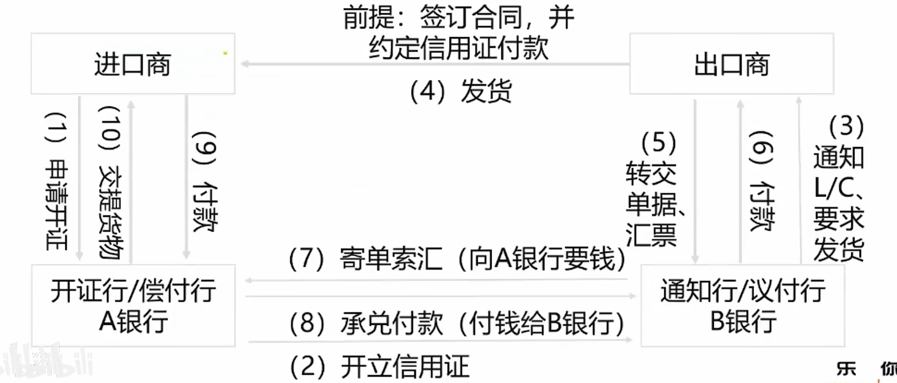

进口商和出口商两国公司，分别找对应的信用较高的银行，进口商找到A银行开了一个信用证，这个信用证写了这批货物的规模、数量价格等，A银行把信用证给B银行，B银行再给出口商，出口商就可以根据信用证来发货，并且形成发票给B银行，由B银行来催收账款。

> 信用证也就是双方各自找担保！

#### 3、福费廷

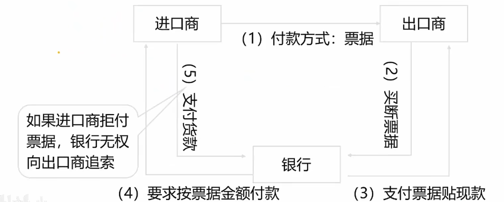

进口商给出口商的付款方式是票据，票据可能需要三个月后才能提现，但是出口商急需钱的时候可以把这个票据卖给银行，银行三个月后再向进口商要钱。重要的是双断制，出口商卖掉票据，就跟这个票据没任何关系了，银行买断票据，银行只跟这个票据有关系了。

**福费廷是远期票据贴现，属中长期融资**。福费廷意为放弃，包括：

- 出口商**卖断票据**，放弃了对所出售票据的一切权益、
- 银行（包买人）**买断票据**，放弃对出口商所贴现款项的追索权（可能承担票据拒付的风险）

#### 4、打包放款

出口商收到境外开来的信用证，出口商在采购这笔信用证有关的出口商品或生产出口商品时，资金出现短缺，用该笔信用证作为抵押，向银行申请本、外币流动资金贷款，用于**出口货物进行加工、包装及运输过程出现的资金缺口**。

> 出口商拿到信用证去搞货物，但是钱不够，就可以用这个信用证去银行贷款。

#### 5、出口押汇

银行凭出口商提供的信用证项下完备的货运单据作抵押，在收到开证行支付的货款之前，向出口商融通资金业务。

> 出口商把货物发了，把信用证卖给银行，银行还未收到进口商银行的钱之前就把信用证的钱给了出口商。

> 打包放款和出口押汇都是银行提前给出口商，只是时间不一样。（了解）
>
> - 打包放款是在货物发货之前
> - 出口押汇是在货物发货之后

### 3.1.6、贷款流程

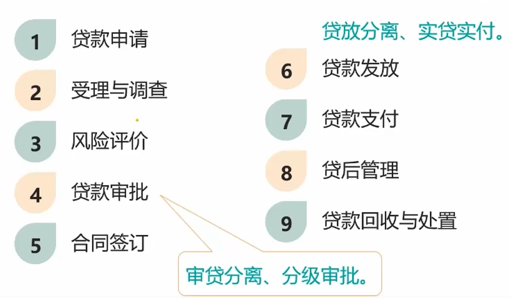

审贷分离，分级审批：审核的和发放贷款的人不能是同一个人

贷放分离，实贷实付：

贷款申请是首要环节，风险评价是最核心的环节。

### 3.1.7、总结

🔥出口方银行为出口商提供的贸易融资服务有：**出廷保款**（出口押汇、福费廷、保理、打包放款）

进口方银行为进口商提供的贸易融资服务有：**进货证**（进口押汇、提货担保、进口保证金）

# 4、外币存款业务

## 4.1、外币存款业务的币种

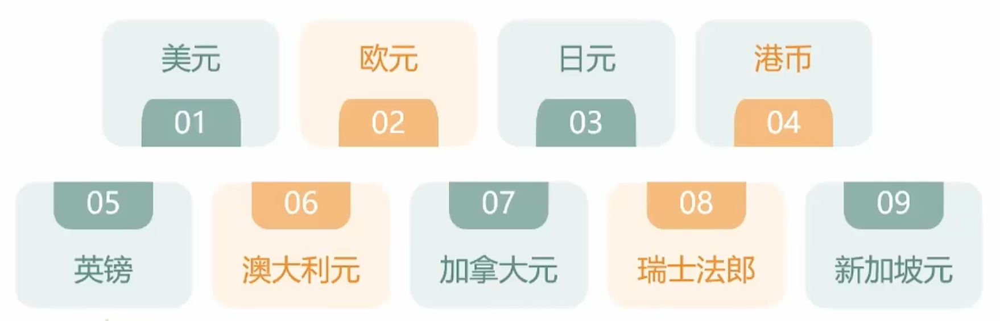

**美英日**带着**两**沓（**大**)**欧**元到**新**开的**港**口坐船去**瑞士**滑雪

> 是瑞士法郎，不是法国法郎！

## 4.2、个人外汇买卖业务

外汇包括现汇和现钞：

- 现汇：可自由兑换的汇票、支票等外币票据
- 现钞：具体的、实在的外国纸币、硬币

> 去银行换外汇原则：钞变钞、汇变汇，钞变汇要手续费。

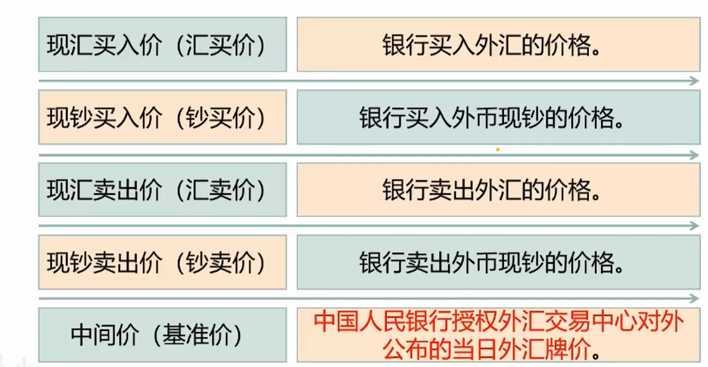

> 现汇买入价和现钞买入价往往不同。**钞买价比汇买价要低**。
>
> 有些银行的卖出价只有一个。

## 4.3、外币存款业务的分类及特点

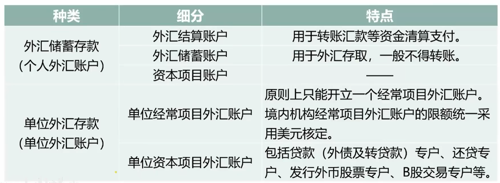

了解个人外汇账户，以单位外汇存款为主。

### 4.4、外币存款业务风险管理

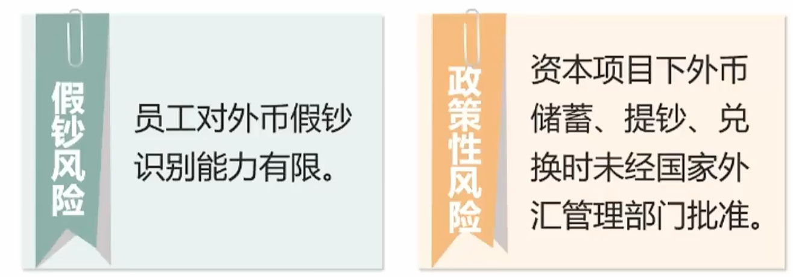

## 4.4、其他存款业务

### 4.4.1、大额存单业务

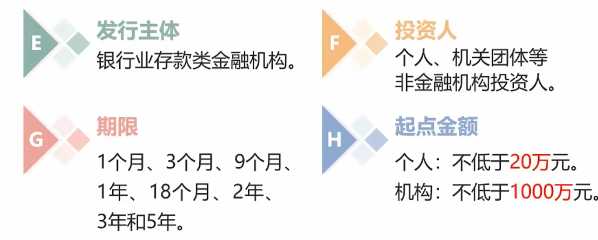

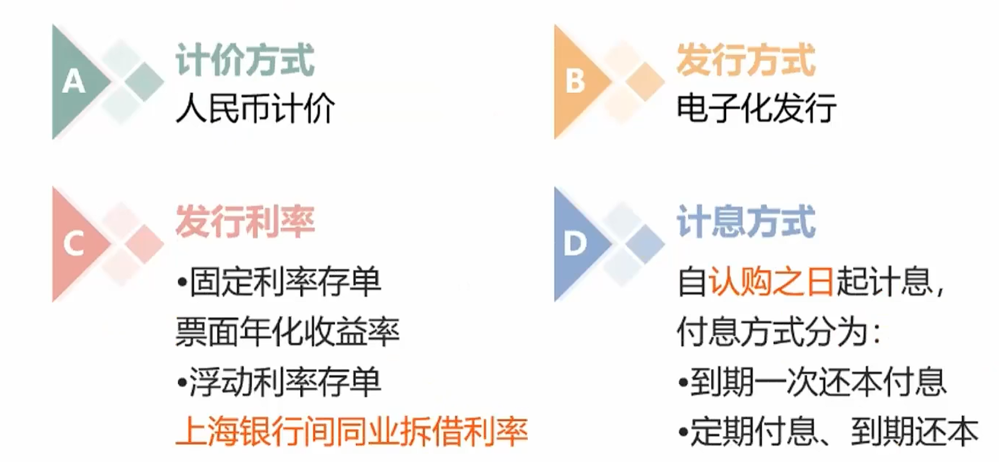

> 大额存单面值较大、期限不定、是银行发行的、利率高、为了筹集资本

### 4.4.2、同业存单业务

同业存单是指由银行业存款类金融机构法人在全国银行间市场上发行的**记账式定期存款凭证**。也就是银行跟银行之间通过存单来进行存款。

存款类金融机构包括：

- **政策性银行**：包括中国进出口银行、中国农业发展银行两家银行
- **商业银行**
- **农村合作金融机构**
- 中国人民银行认可的其他金融机构

在进行同业存单发行的过程中，主要是通过银行间拆借中心的。全国银行间同业拆借中心提供同业存单的发行、交易和信息服务同业存单在银行间市场清算所股份有限公司登记、托管、结算。

发行方式有两种：

- 公开发行：可以进行交易流通，可以作为回购交易标的物
- 定向发行：只能在该只同业存单初始投资人范围内流通。

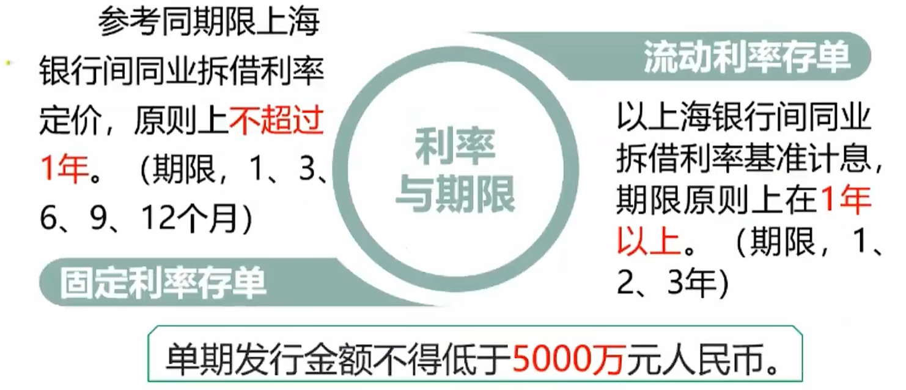

### 4.4.3、个人结构性存款

个人结构性存款是银行向个人发售的在普通外汇存款的基础上嵌入某种金融衍生工具，通过与**利率、汇率、指数**等的波动挂钩或与
某实体的信用情况挂钩，使存款人在承受一定风险的基础上获得更高收益的外汇存款。

> 就是理财！

特点是**本金无风险，发展初期只对等值300万美元的大额外汇存款**提供。

### 4.4.4、向中央银行借款

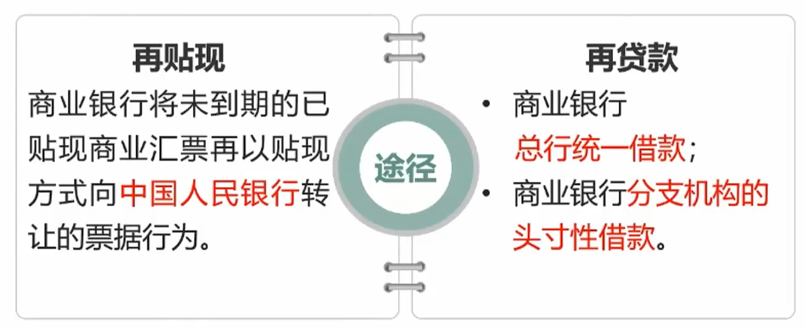

### 4.4.5、金融债券

**金融债券就是指商业银行等金融机构通过发行债券的方式来筹集资本，约定到期还本付息的一种操作。**

金融机构包括银行和非银行类金融机构，政策性银行发行的叫做政策性金融证券，商业银行发行的叫做商业银行债券。

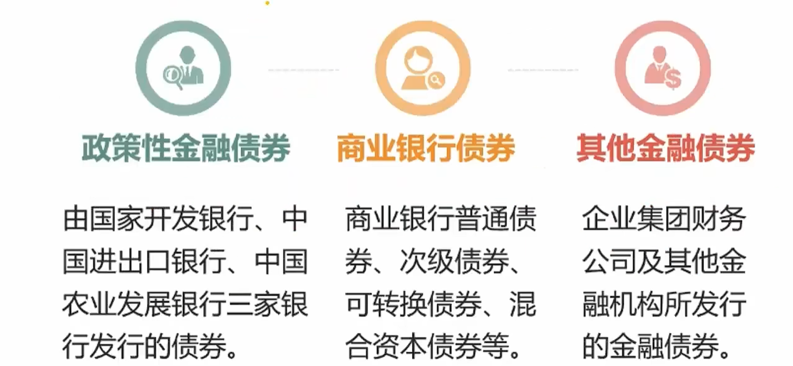

#### 1、金融债券应具备的条件

政策性金融证券不以盈利为目的，但是商业银行债券就不一样了，所以对于商业银行发行证券需要它有一定的条件：

- 具备良好的公司治理机制
- 核心资本充足率不低于4%
- 最近**三年**连续盈利
- **贷款损失准备金提重足**
- 风险监管指标符合监管机构的有关规定
- 最近三年没有重大违法、违规条件
- 中国人民银行要求的其他条件

