# 1、银行管理基础

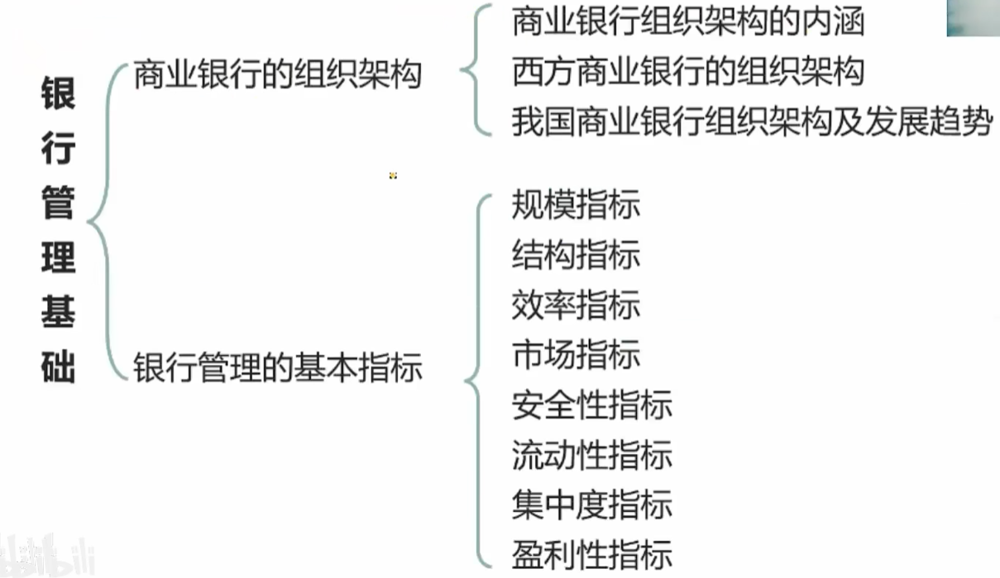

## 1.1、商业银行组织架构的形式

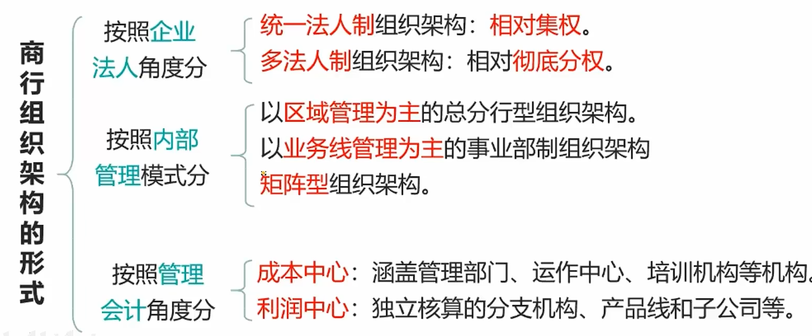

**统一法人制**组织架构：分支机构的经营自主权较小

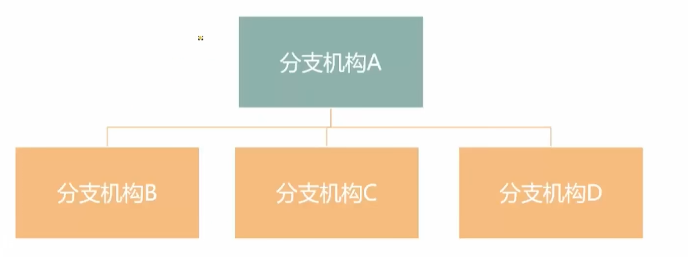

**多法人制**组织架构：分支机构的经营自主权较大

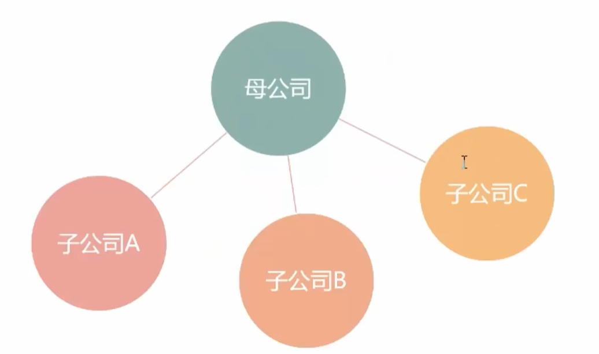

以**区域管理为主**的总分型组织架构：广发银行如此

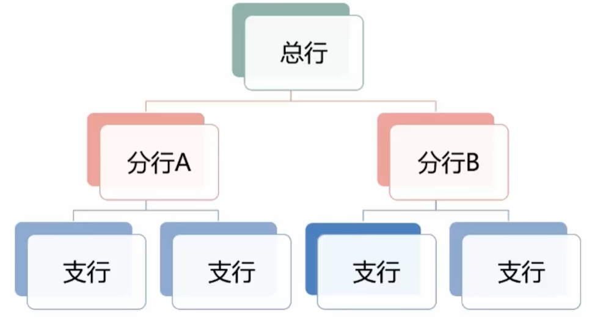

以**业务线管理为主**的事业部制组织架构：例如贷款为一个业务线副总经理去指导利润

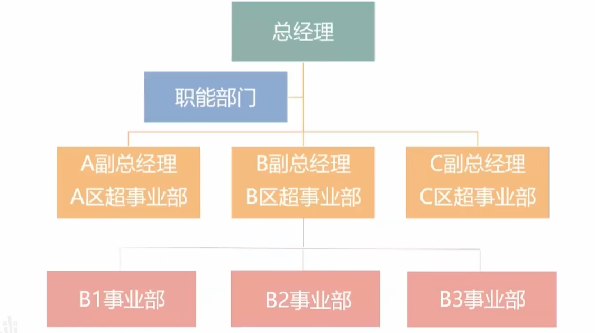

**矩阵型**组织架构：集合区域管理和业务线管理

## 1.2、西方商业银行的组织架构

银行组织架构的主流模式：**以客户为中心**的矩阵型组织架构

矩阵型组织架构特点：

- 建立以**客户需求**为基础的**五大业务线**
  - **零售业务**：针对个人客户，开户、房贷车贷、支付等业务统一称为零售业务
  - **财富管理业务**：针对个人客户，办理大型理财业务
  - **商业银行业务**：针对单位客户，贸易融资、贷款等
  - **金融市场业务**：针对单位客户，外汇、证券、基金等
  - **投行业务**：针对单位客户，债券发行，IP0等
- **采取不同的顶层组织架构设计**
  - 采用"**大个金**"和"**大公金**"两大业务板块
    - 将个人的金融业务放到一个板块，将公司的金融业务放到一个板块。
    - 将主要为**个人客户**提供服务的**零售业务和财富管理业务**放在一个板块来管理。
    - 将主要为**企业和机构**客户提供服务的**商业银行**业务、**金融市场**业务和**投行**业务放在一个板块。
    - 代表银行：**渣打、德意志、花旗。（大德花渣：大德这个人很花心，是渣男）**
  - 根据客户需求层次来组合业务板块
    - 根据客户的**基础金融需求和高端金融需求**来划分业务板块。
    - 代表银行：**法国巴黎银行**
  - 根据业务线只能设置组织架构模式
    - 业务板块分得更为**细致**，根据业务线职能设置组织架构、提供**专业化**服务。
    - 代表银行：**摩根大通银行、巴克莱银行和苏格兰皇家银行**   **耶(业)稣(苏)克魔(摩)**

## 1.3、我国商业银行组织架构

- **从企业法人角度看**：**统一法人组织架构**
- **从内部管理角度看**：**以区域管理为主的总分行型组织架构**

我国商业银行组织架构发展趋势:

1. 渐进式推进事业部制改革：目前我国银行是总分行型，对于业务线是淡化的，所以要推进事业部制改革
2. 建立垂直化风险管理体系：
   - 建立**垂直化**的组织运作机制
   - 将风险管理职能进一步**向总行本部集中**，减少不必要的中间层级，逐步**形成横向延展、纵向深入的扁平化矩阵模式**
   - 提高风险管理的专业化水平
3. 建设流程银行
   - **以客户为中心**
   - 以**业务线垂直运作**和管理为主
   - 前中后台**相互分离、相互制约**，以流程落实内控
   - 实施以**业务单元纵向为主**的矩阵考核方式
   - 中后台**集中式**运作和管理
   - 业务流程实现**信息化、自动化、标准化和智能化**

# 2、公司治理

商业银行公司治理指**股东大会、董事会、监事会、高级管理层、股东**及其他利益相关者之间的相互关系包括**组织架构、职责边界、履职要求等治理制衡机制**以及**决策、执行、监督、激励约束等治理运行机制**

## 2.1、内部控制

商业银行**董事会、监事会、高级管理层和全体员工(两会一层一员工)**参与的通过制定和实施系统化的制度、流程和方法，实现控目标的**动态过程和机制**。

### 2.1.1、内部控制目标与基本原则🔥

目标：

1. 保证国家有关法律法规及规章的贯彻执行
2. 保证商业银行发展战略和经营目标的**实现**
3. 保证商业银行**风险管理的有效性**
4. 保证商业银行**业务记录、会计信息、财务信息和其他管理信息的真实、准确、完整和及时**

基本原则：

1. **全覆盖**原则
2. **制衡性**原则
3. **审慎性**原则
4. **相匹配**原则

### 2.1.2、内部控制措施

1. 内控制度
2. 风险识别
3. 信息系统
4. 岗位设置
5. 员工管理
6. 授权管理
7. 会计核算
8. 监控对账
9. 外包管理
10. 投诉处理

### 2.1.3、内部控制保障

1. 信息系统控制
2. 人员管理
3. 报告机制
4. 考评管理
5. 业务连续性管理
6. 内控文化

## 2.2、合规管理

合规：使商业银行的**经营活动与法律、规则和准则相一致**。

合规风险：商业银行因没有遵循法律、规则和准则可能**遭受法律制裁、监管处罚、重大财务损失和名誉损失的风险**。

合规管理：银行有效识别和监控合规风险、主动预防违规行为发生的动态过程。

### 2.2.1、合规管理的重点内容

- 建设强有力的合规文化
  - 合规是商业银行所有员工的共同责任，并应从**商业银行高层**做起。董事会和高级管理层应确定合规的基调，确立全员主动合规、合规创造价值等合规理念，在全行推行诚信与正直的职业操守和价值观念，提高全体员工的合规意识
- 建立有效的合规风险管理体系
  - 建立对管理人员的合规绩效的**考核制度**
  - 建立有效的合规**问责制度**
  - 建立诚信**举报制度** 
- 建立有利于合规风险管理的基本制度

# 3、商业银行资产负债管理

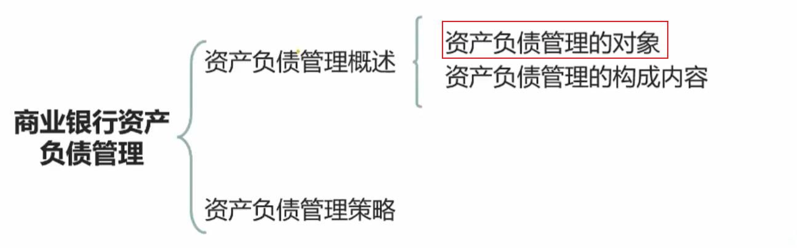

## 3.1、传统资产负债管理的对象

传统资产负债管理的对象：银行的**资产负债表**

资产负债管理：以**安全性、流动性**为基本前提，通过**盈利性实现商业银行价值的最大化**。(安流盈)

## 3.2、新环境下资产负债管理的对象

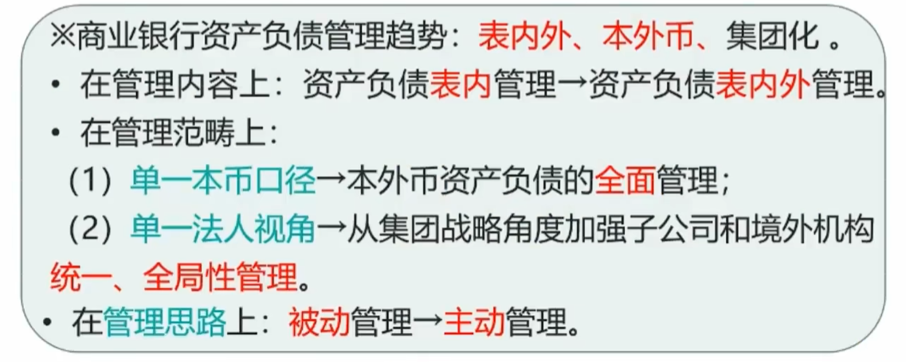

- 现在资产管理是**资产负债表内+资产负债表外**

## 3.3、资本负债管理的构成

### 3.3.1、资本管理

- 监管资本管理
- 经济资本管理
- 账面资本管理

### 3.3.2、资产负债组合管理

特点：资产负债组合管理是对银行资产负债表进行**积极的管理**

1. 资产组合管理（以资本约束为前提）
2. 负债组合管理
3. 资产负债匹配管理

### 3.3.3、资产负债计划管理

资产负债**总量计划**：根据**全行资本总量和资本充足率水平**来确定资产负债总量计划

资产负债**结构计划**：

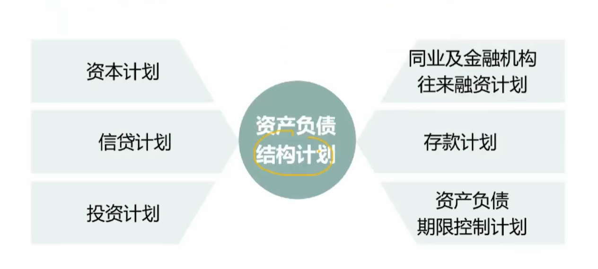

### 3.3.4、定价管理

特点：商业银行经营管理的**核心内容**，**直接影响银行的经营利润**（比如支付收取手续费、赚利率差等，所以定价也就是设置利率）
内容

- 外部产品定价管理
- 内部资金转移定价管理

### 3.3.5、流动性风险管理

良好的流动性状况是**商业银行安全稳健运营的基础**。

内容：

- 建立科学完善的管理机制，
- 对流动性风险实施有效地识别、计量、预警、监控和报告。

### 3.3.6、汇率风险管理

汇率风险：汇率风险是指由于**汇率波动**造成以**基准计价的资产**遭受价值损失和财务损失的可能性。

## 3.4、资金管理

建设**内部资金转移定价机制**和**全额资金管理体制**，建成**以总行为中心，自下而上集中资金和自上而下配置资金的收支两条线**、全额计价、集中调控、实时监测和控制全行资金流的现代商业银行司库体系。

# 4、资本管理

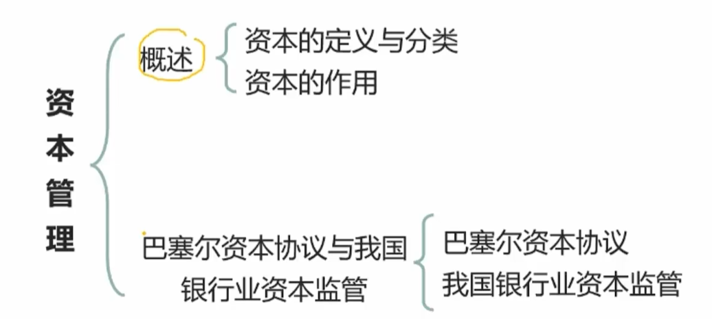

## 4.1、资本的分类

1. 账面资本（会计资本）
2. 监管资本
3. 经济资本

### 4.1.1.、账面资本

账面资本包括**实收资本**或**普通股、资本公积、盈余公积、未分配利润**等。反映了**银行实际拥有的资本水平，是银行资本金的静态反映**。

> 账面资本 = 银行自己全部的钱 - 银行负债的钱

### 4.1.2、监管资本

两个层级的概念：

- 银行**实际持有的符合监管规定的合格资本**
- 银行**按照监管要求应当持有的最低资本量**或**最低资本要求**。

### 4.1.3、经济资本

经济资本是为了应对未来一定期限内资产的**非预期损失**而应该持有或需要的资本金，是根据银行资产的风险程度计算出来的**虚拟资本**

> 也就是银行的私房钱

### 4.1.4、三种资本之间的关系

- 提出角度：账面资本反映的是所有者权益，而监管资本、经济资本则是从覆盖风险与吸收损失的角度提出的资本概念。
- 资本功能：账面资本与监管资本（银行持有的合格资本）具有交叉，可以用于吸收损失。

- 数量角度：账面资本经过一定的调整，可以得到符合监管要求的合格资本，**合格资本的数额应大于最低监管资本要求(不然银行可能会有破产风险)**；银行要稳健、审慎经营，**持有的账面资本还应大于经济资本**。
- 银行管理角度：相对于监管资本，经济资本更好地反映了银行的风险状况和资本需求，对银行风险变动具有更高的敏感性，目前已
  经成为先进银行广泛应用的管理工具

## 4.2、资本的作用

1. 为银行提供融资
2. 吸收和消化损失
3. 限制银行业务过度扩张
4. 维持市场信心

## 4.3、巴塞尔资本协议

### 4.3.1、第一版巴塞尔资本协议

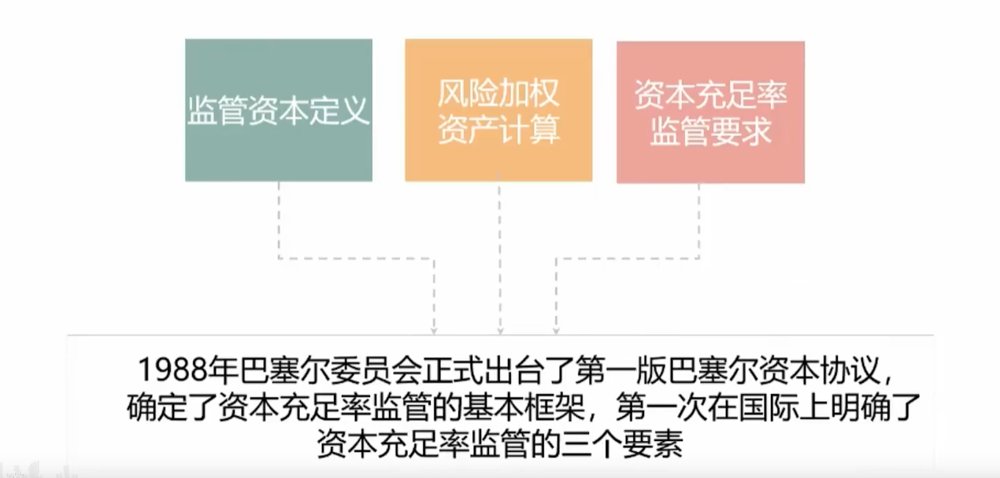

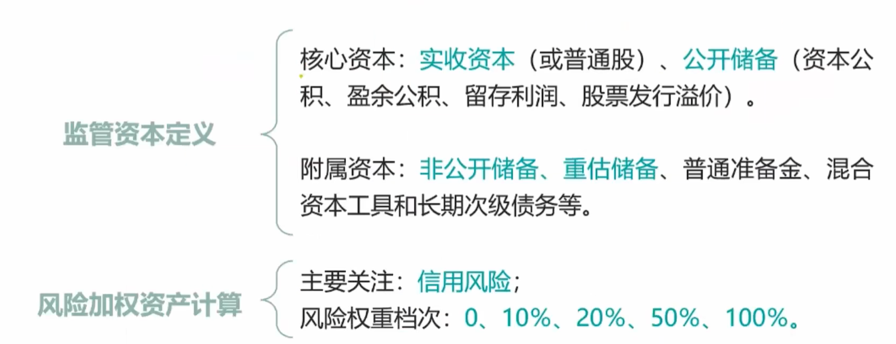

核心资本口诀：**双积一收留**（两个人积累财富去收留了一个孩子）

风险加权：将资产的账面价值与相应的风险权重相乘，计算出风险加权，从而去综合反映这个资产的风险水平。例如广发有1000万去发放贷款风险是50%，又用1000万买了股票，风险是100%。则风险加权 = 1000万×50% + 1000万×100%

> 小Tips：银行不能买股票

### 4.3.2、第二版巴塞尔协议（新巴塞尔协议）

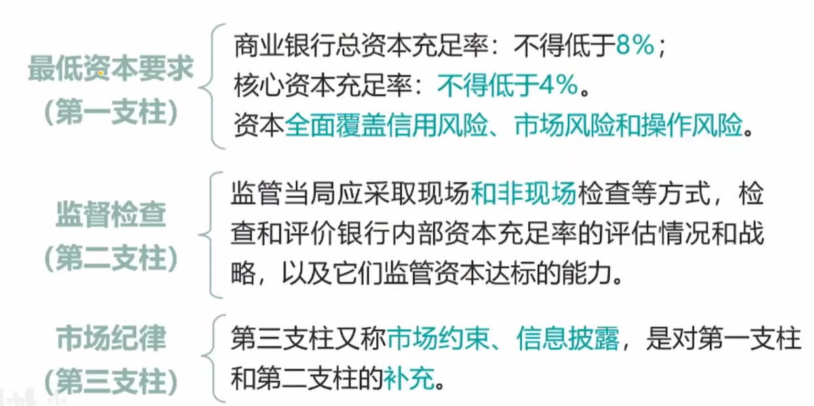

第一版巴塞尔协议注重信用风险，第二版巴塞尔协议注重信用、市场和操作风险。

### 4.3.3、第三版巴塞尔协议

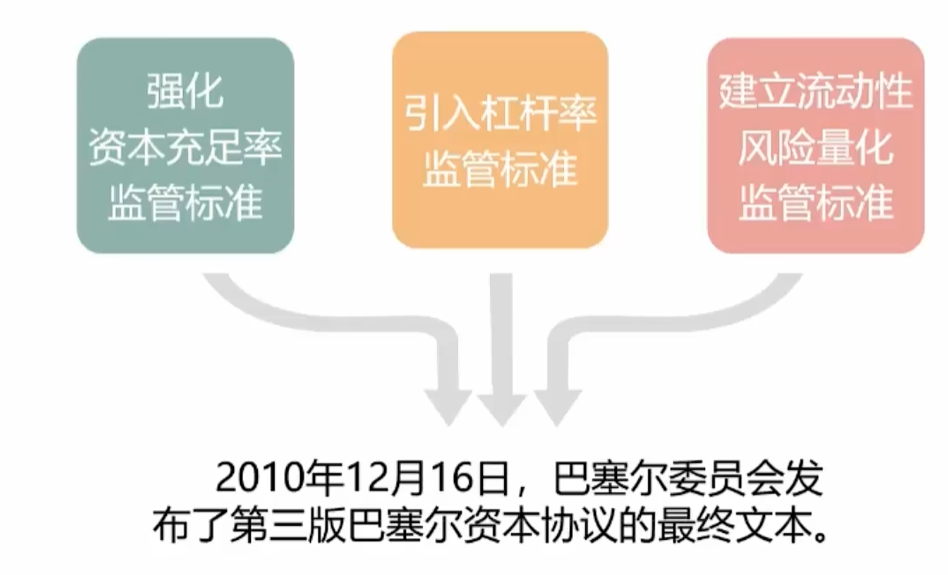

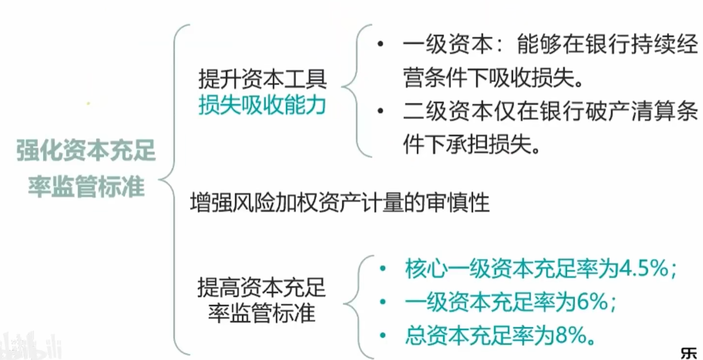

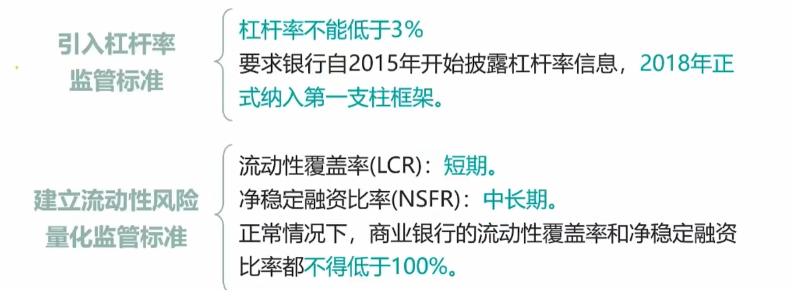

## 4.4、我国银行业资本监管

### 4.4.1、资本充足率计算公式

资本充足率 = （**总资本** - 对应资本扣减项） / **风险加权资产** × 100%

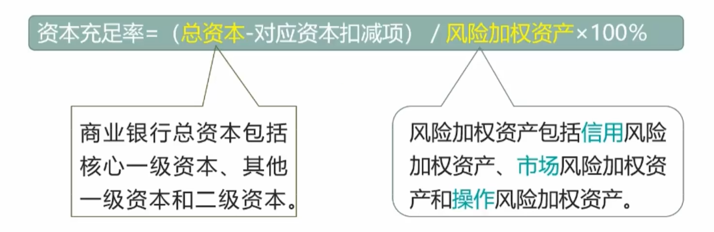

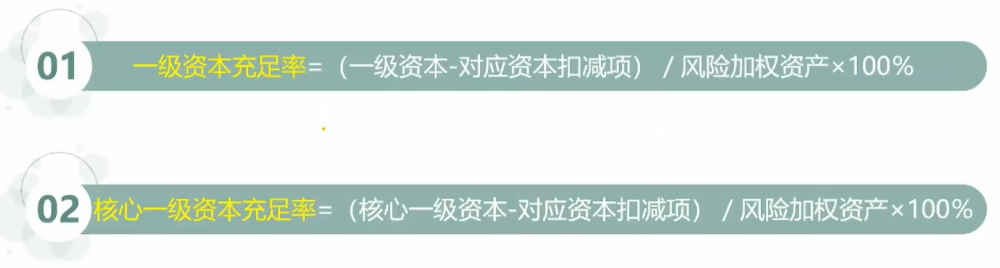

### 4.4.2、资本定义

#### 1、一级资本

核心一级资本

- 特点:银行资本中**最核心**的部分，**承担风险和吸收损失的能力最强**。
- 内容:实收资本或普通股、资本公积、盈余公积、一般风险准备、未分配利润、少数股东资本可计入部分。

> 核心一级资本比核心资本少了一个 股票溢价发行款,多了 一般风险准备 + 少数股东资本可计入部分

其他一级资本

- 内容：其他一级资本工具（优先股、永续债等）及其溢价，少数股东资本可计入部分。

#### 2、二级资本

内容：二级资本工具（次级债、可转债及符合条件的超额贷款损失准备金）及其溢价、超额贷款损失准备，少数股东资本可计入部分。

资本扣除项：

- 内容：商誉、其他无形资产（土地使用权除外），由经营亏损引起的净递廷税资产、贷款损失准备缺口等。

### 4.4.3、资本充足率监管要求

第一层次（最低资本要求）

- 核心一级资本充足率为5%（三版巴塞尔协议是4.5%）
- 一级资本充足率为6%（三版巴塞尔协议是6%）
- 总资本充足率为8%（三版巴塞尔协议是8%）

第二层次（储备资本要求和逆周期资本要求）

- 储备资本为2.5%
- 逆周期资本为0 ~ 2.5%
- 两者均由核心一级资本满足

> 所以我国银行的总资本充足率最低为 8% + 2.5% +0% = 10.5%

第三层次（系统重要性银行【中农工建交】附加资本要求）

- 国内要求为1% (10.5% + 1% = 11.5%)
- 由核心一级资本满足

> 根据《资本办法》的规定正常时期我国**系统重要性银行**和**非系统重要性银行**的资本充足率要求分别为**11.5%**和**10.5%**
>
> - 《资本办法》设定了6年的资本充足率达标过渡期。
> - 我国商业银行应于2018年底前全面达到相关资本监管要求，并鼓励有条件的银行提前达标。

