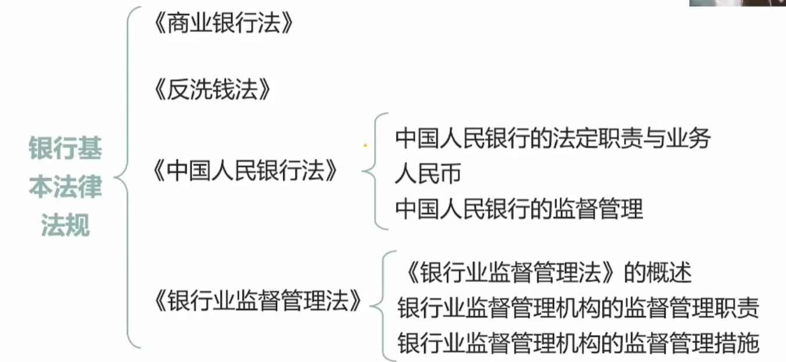
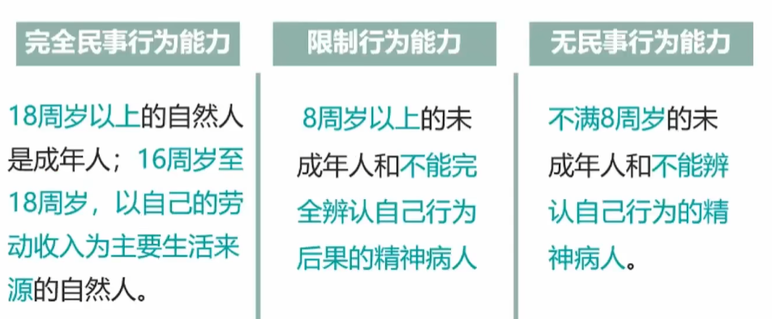
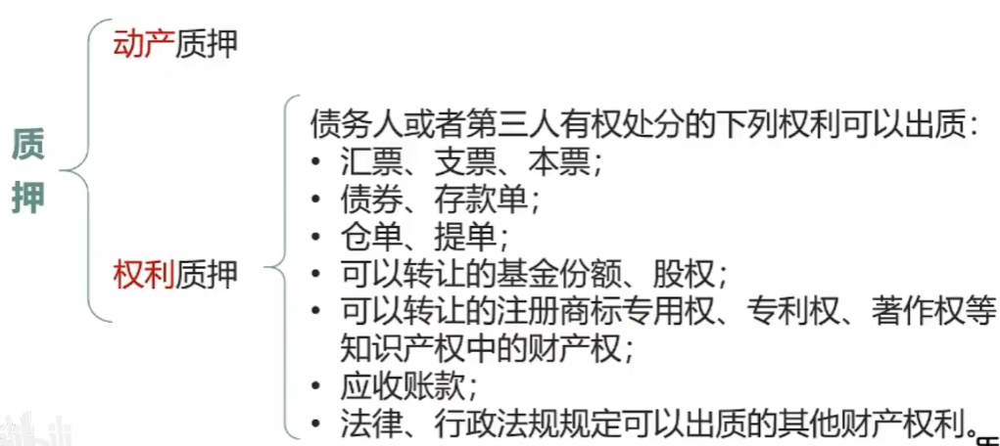

# 1、银行基本法律法规

## 1.1、中国人民银行的职能

1. 制定和执行货币政策
2. 防范和化解金融风险
3. 维护金融稳定

## 1.2、中国人民银行的主要职责

1. 发布与履行其职能有关的命令和规章
2. 依法制定和执行货币政策
3. 发行人民币，管理人民币流通
4. 监督管理银行间同业拆借市场和银行间债券市场
5. 实施外汇管理，监督管理银行间外汇市场
6. 监督管理黄金市场
7. 持有、管理、经营国家外汇储备、黄金储备
8. 经理国库
9. 维护支付、清算系统的正常运行
10. 指导、部署金融业反洗钱工作，负责反洗钱的资金监测
11. 负责金融业的统计、调查、分析和预测

## 1.3、中国人民银行不得从事的业务和工作

1. 不得对银行业金融机构的账户透支
2. 不得对政府财政透支，不得直接认购、包销国债和其他政府债券
3. 不得向地方政府、各级政府部门提供贷款，不得向非银行金融机构以及其他单位和个人提供贷款，但国务院决定中国人民银行可以向特定的非银行金融机构提供贷款的除外
4. 不得向任何单位和个人提供担保

# 2、人民币

人民币的法定管理部门：中国人民银行

地位：中华人民共和国的**法定货币**

单位：元

辅币单位：角、分

## 2.1、人民币的禁止性规定

《中国人民银行法》规定:

1. 禁止**伪造、变造**人民币。禁止出售、购买伪造、变造的人民币。禁止运输、特有、使用伪造、变造的人民币。禁止故意毁损人民币。禁止在宣传品、出版物或者其他商品上非法使用人民币图样。
2. **出售**伪造、变造的人民币，或者明知是伪造、变造的人民币而运输构成犯罪的，依法追究刑事责任；尚不构成犯罪的，由公安机关处十五日以下拘留、一万元以下罚款。
3. **购买**伪造、变造的人民币或者明知是伪造、变造的人民币而特有使用，构成犯罪的，依法追究刑事责任；尚不构成犯罪的，由公安机关处十五日以下拘留、一万元以下罚款。
4. 在宣传品、出版物或者其他商品上**非法使用人民币图样的**，中国人民银行应当责令改正，并销毁非法使用的人民币图样，没收违法所得并处五万元以下罚款

# 3、中国人民银行的监督管理

1. 直接检查监督权
2. 建议检查监督权
3. 特定条件下的检查监督权

## 3.1、直接检查监督权

- 执行有关**存款准备金管理规定**的行为；
- 与**中国人民银行特种贷款有关**的行为，
- 执行有关**人民币管理**规定的行为：
- 执行有关银行间**同业拆借市场和银行间债券市场管理**规定的行为；
- 执行有关**外汇管理**规定的行为；
- 执行有关**黄金管理**规定的行为；
- 代理中国人民银行**经理国库**的行为；
- 执行有关**清算管理**规定的行为；
- 执行有关**反洗钱**规定的行为

## 3.2、建议检查监督权

如果中国人民银行还想有其他方面的检查权，则中国人民银行需要向银监会申请权力，银监会(也叫银保监会)应当自收到建议之日起30日内予以回复。

## 3.3、特定条件下的检查监督权

- 中国人民银行根据履行职责的需要，有权要求银行业金融机构报送必要的资产负债表、利润表以及其它财务会计、统计报表和资料。
- **中国人民银行**和**国务院银行业监督管理机构**同时拥有对银行业金融机构的检查监督权，**并不会导致**对银行业金融机构的双重检查和双重处罚。

# 4、《银行业监督管理法》的适用范围

## 4.1、银监会(银保监会)

国务院于**2003年3月19日设立了中国银监会**，银监会负责对全国银行业金融机构及其业务活动**监督管理的工作**。

法定监管目标：

1. 促进银行业的**合法、稳健运行，维护公众对银行业的信心**
2. 保护**银行业公平竞争，提高银行业竞争能力**。

监管范围：

- **银行业金融机构**：在中华人民共和国境内设立的商业银行、城市信用合作社、农村信用合作社等**吸收公众存款的金融机构以及政策性银行**。
- **非银行业金融机构**：在中华人民共和国境内设立的**金融资产管理公司、信托投资公司、财务公司、金融租赁公司**以及经国务院银行业监督管理机构批准设立的其他金融机构。
- **其他**：经其批准在境外设立的金融机构以及**上述境内金融机构在境外的业务活动。**

> 注意：证券、基金是由**证券会**来进行管理！

## 4.2、银监会监督管理职责

- **制定并发布监管制度的职责**：==监管制度是银监会搞的，不是央妈搞的==
- 报告职责
- **准入职责**：比如银行开分行、支行需要给银监会报备，控制准入金融圈
- 指导、监督、自律职责
- **非现场监管职责**
- 国际交流合作职责
- **现场检查职责**

### 4.2.1、准入职责

## 4.3、银监会的监督管理措施

### 4.3.1、非现场监管措施

《银行业监督管理法》规定，银行业金融机构**不按照规定提供报表、报告**等文件、资料的，由银监会及其派出机构责令改正，逾期不改正的，处十万元以上三十万元以下罚款。

### 4.3.2、现场检查

国务院银行业监督管理机构及其派出机构根据审慎监管的要求，可以采取下列措施进行现场检查：

- 进入**银行业金融机构进行检查**；
- **询问银行业金融机构的工作人员**，要求其对有关检查事项作出说明；
- **查阅、复制**银行业金融机构与检查事项有关的文件、资料，对可能被转移、隐匿或者毁损的文件、资料予以封存，
- 检查银行业金融机构运用**电子计算机管理业务数据的系统**。

进行现场检查，应当经银监会及其派出机构负责人批准。现场检查时，检查人员**不得少于二人**，并应当出示合法址件和检查通知书。检查人员**少于二人或者未出示合法证件和检查通知书**的银行业金融机构有权拒绝检查。

### 4.3.3、对违反审慎经营规则的监管措施

银行业金融机构违反审慎经营规则的，**国务院银行业监督管理机构或者其省一级派出机构**应当责令限期改正；逾期未改正的，或者其行为严重危及该银行业金融机构的稳健运行、损害存款人和其他客户合法权益的，经国务院银行业监督管理机构或者其省一级派出机构负责人批准，可以区别情形，采取下列措施：

- 责令**暂停**部分业务、**停止**批准开办新业务
- **责令控股股东转让股权**或者**限制有关股东的权力**
- 责令**调整董事、高级管理人员或者限制其权力**
- **限制分配红利和其他收入**
- 限制**资产转让**
- **停止**批准增设分支机构

> 停、限、责

银行业金机构整改完毕后，应当向**银监会或者其省一级派出机构**提交报告，银监会或者其省一级派出机构自验收完毕之日起**三日内解除**前款措施。

### 4.3.4、对问题银行业金融机构的监管措施

- 接管
  - 银监会依法保护银行业金融机构**经营安全、合法**的一项**预防性拯救措施**。其目的在于对被接管银行业金融机构采取必要措施，以保护存款人的利益，恢复银行业金融机构的正常经营能力。
- 促成重组
  - 按照具体重组方案（或重组计划），通过**合并、兼并收购、购买与承接**等方式改变问题银行业金融机构的资本结构，合理解决债务，摆脱财务困难，继续经营。对于**重组失败**的，银监会可以决定**终止重组，转由人民法院依法宣告破产**。
- 撤销
  - 银监会对经其批准设立的**具有法人资格**的银行业金融机构依法采取的终止其法人资格的行政强制措施。

在接管、机构重组或者撤销清算期间，经国务院银行业监督管理机构负责人批准，对直接负责的**董事、高级管理人员和其他直接责任人员**，可以采取下列措施：

1. 直接负责的董事、高级管理人员和其他直接责任人员出境将对国家利益造成重大损失的，通知出境管理机关依法**阻止其出境**
2. 申请司法机关**禁止其转移、转让财产或者对其财产设定其他权利**。

### 4.3.5、银监会其他监督管理措施

1. 延伸调查
2. 审慎性监督管理谈话（监管谈话）
3. 强制披露
4. 查询涉嫌违法账户和申请司法机关冻结有关违法资金

#### 1、延伸调查

对调查的面更广了

1. 措施：询问有关单位或者个人，要求其进行情况说明；**查阅、复制有关财务会计、财产权登记**等文件、资料；对可能被**转移、隐匿、毁损或者伪造**的文件、资料，予以先行登记保存。
2. 规定：调查人员**不得少于2人**，并应**出具合法证件和调查通知书**。
3. 要求：有关单位和个人应当**如实说明有关情况并提供有关文件、资料，不得拒绝、阻碍和隐瞒。**

#### 2、审慎性监督管理谈话（监管谈话）

1. 监管谈话的作用在于使监管人员与被监管银行业金融机构保持持续不断的沟通，及时了解其经营状况、风险状况，并预测发展趋势，以便继续跟踪监管，提高监管效率。
2. 监管部门有权根据监管需要和银行业金融机构经营状况，随时向银行业金融机构提出谈话要求，但**进行监管谈话并不意味着银行业金融机构一定存在经营问题。**（有可能是你挺好，但是为了让你更好提点建议）

#### 3、强制披露

1. 银监会及其派出机构应当责令银行业金融机构按照规定如实向社会公众披露**财务会计报告、风险管理状况、董事和高级管理人员变更以及其他重大事项**等信息。
2. 银行业金融机构未按照规定进行信息披露的，由银监会责令改正，并处20万元-50万元罚款。情节特别严重或者逾期不改正的，可以责令停业整顿或者吊销营业许可证；构成犯罪的，依法追究刑事责任。

#### 4、查询涉嫌违法账户和申请司法机关冻结有关违法资金

**经银监会或其省一级派出机构负责人批准**，银监会及其派出机构有权**查询**涉嫌金融违法的银行业金融机构及其工作人员以及关联行为人的账户；对涉嫌转移或隐藏违
法资金的，经银监会及其派出机构负责人批准可以申请司法机关予以**冻结**。

# 5、民事法律制度

## 5.1、民法

调整平等的民事主体之间**人身关系**和**财产关系**法律规范的总称。

### 5.1.1、民法的基本原则

- **平等原则**
- **自愿原则**
- **公平原则**
- **诚实信用**原则：**是核心**
- 守法和公序良俗原则
- 绿色原则

### 5.1.2、自然人

- 自然人的**民事权力能力**：民事主体依法享有民事权力，承担民事义务的资格。自然人民事权力始于出生，终于死亡。

- 自然人的**民事行为能力**：也就是人在相应年龄能做的事情，民事主体能以自己的行为取得民事权力、承担民事义务的能力。

### 5.1.3、监护人

如果**未成年人**的父母已经死亡或者没有监护能力的，按照以下顺序确定其中有监护能力的人担任监护人：

1. **祖父母、外祖父母**
2. **兄、姐**
3. 其他愿意担任监护人的个人或者组织，但是须经未成年人住所地的居民委员会、村民委员会或者民政部门同意。

对于无民事行为能力或者限制民事行为能力的成年人，**按照下列顺序确定担任监护人**：

1. **配偶**
2. **父母、子女**
3. 其他近亲属
4. 其他愿意担任监护人的个人或者组织，但是须经未成年人住所地的居民委员会、村民委员会或者民政部门同意。

监护人的职责：

1. **担任被监护人的法定代理人，代理被监护人进行民事活动**：
2. **保护被监护人的人身、财产及其他合法权益**。
3. 监护人应当按照最有利于被监护人的原侧履行监护职责，除为被监护人的利益外，不得处理被监护人的财产。监护人不履行监护职责或者侵害被监护人的合法权益的，应当承担责任；给被监护人造成财产损失的，应当赔偿损失。人民法院可以根据有关人员或者有关单位的申请，撤销监护人的资格。

### 5.1.4、法人

营利法人：

- 有限责任公司
- 股份责任公司
- 其他企业法人

特别法人：

- 机关法人
- 农村集体经济组织法人
- 城镇农村合作经济组织法人
- 基层群众性自治组织法人

非营利法人：

- 事业单位
- 社会团体
- 基金会
- 社会服务机构

法人的成立条件：

- **依法成立**
- 实体合法
- 程序合法
- **有自己的名称、组织机构、住所、财产或者经费**

### 5.1.5、非法人组织

非法人组织包括：

- 个人独资企业
- 合伙企业
- 不具有法人资格的专业服务机构

债务清偿：非法人组织的财产不足以清偿债务的，其出资人或者设立人承担**无限责任**。

## 5.2、民事法律行为与代理

民事法律行为的要件和形式：

### 5.2.1、可撤销的民事行为(相对无效的民事行为)

下列民事法律行为，一方有权清求人民法院或者仲裁机关予以撤销：

1. 基于**重大误解**实施的民事法律行为，行为人有权请求人民法院或者仲
   裁机构予以撤销
2. **一方以欺诈手段，使对方在违背真实意思的情况下实施的民事法律行**
   **为**，受欺诈方有权请求人民法院或者仲裁机构予以辙销
3. **第三人实施欺诈行为**，使一方在违背真实意思的情况下实施的民事法律行为，对方知道或者应当知道该欺诈行为的，受欺诈方有权请求人民法院或者仲裁机构予以撤销

民事法律行为无效、被撤销或者确定不发生效力的法律后果：

- 返还财产
- 赔偿损失
- 追缴财产

### 5.2.2、代理

代理的法律特征：比如中介帮你卖东西

- 代理行为是指**能够引起民事法律后果**的民事法律行为。
- 代理人一般应**以被代理人的名义从事代理活动**。
- 代理人在代理权限范围内**独立意思表示**。
- 代理行为的**法律后果直接归属于被代理人**。

代理的种类：

1. 法定代理：父母是子女的法定监护人
2. 委托代理

#### 1、无权代理

无权代理，中介跳过你直接帮你卖东西

#### 2、表见代理

表见代理：你子女跳过你帮你卖东西

#### 3、委托代理终止的情形

- 代理期间届满或者代理事务**完成**
- 被代理人**取消**委托或者代理人辞去委托
- 代理人**丧失**民事行为能力(中介精神病了)
- 代理人或者被代理人**死亡**
- 作为代理人或者被代理人的法人、非法人组织**终止**

#### 4、法定代理终止的情形

1. 被代理人取得或者恢复完全民事行为能力
2. 代理人丧失民事行为能力
3. 代理人或者被代理人死亡
4. 法律规定的其他情形

# 6、物权基本法律制度

物权，是指权利人依法对特定的物享有直接支配和排他的权利。**物权与债权都是民法中最基本的财产权利。**
物权包括：

- **所有权**（国家所有权、集体所有权、私人所有权，并派生出建筑物区分所有权)
- **用益物权**（土地承包经营权、建设用地使用权、宅基地使用权等)
- **担保物权**（抵押权、质权和留置权）

## 6.1、物权的特征

1. 物权是绝对权
2. 物权是支配权
3. 物权的标的是物：单位是物品
4. 物权具有排他性
5. 物权具有追及力：丢了可以找回来

## 6.2、物权的基本原则

1. **平等保护**原则
2. **物权法定**原则
3. **一物一权**原则
4. **公示、公信**原侧

## 6.3、担保法律制度

### 6.3.1、抵押

抵押不转移所有权：比如房子抵押，但是你还是可以住

> 作为抵押物的财产**既可以是动产，也可以是不动产**。以抵押方式设定的担保方式最突出的特点在于**不转移财产的占有**。

抵押要以**书面形式**签署：

- 被担保债权的**种类和数额**

- 债务人履行债务的**期限**

- 抵押财产的**名称、数量、质量、状况**、所在的、所有权属或者使用权归属
- 担保的**范围**

抵押合同和抵押权**设立分离机制**：抵押合同可以先生效，抵押权设立则需经过一定的法定收需后才能生效。

抵押权的实现形式：通过抵押物的**处分获得优先受偿权**而实现。抵押财产**折价**或者**拍卖、变卖**后，其价款**超过债权**数额的部分归**抵押人**所有，不足部分**由债务人清偿。**

> 比如房子300万抵押，法院将这个房子卖了600万，则差额300万会返回给你。

### 6.3.2、清偿

如果你的抵押物抵押给了两个人，同一财产向**两个以上债权人抵押的**，拍卖变卖抵押财产所得的价款依照下列规定清偿：

1. 抵押权已登记的，按照**登记先后顺序**清偿；顺序相同的，按照债券比例清偿
2. 抵押权**已登记的先于未登记**的受偿，
3. 抵押权未登记的，按照**债权比例清偿**。

### 6.3.3、质押

质押：把车放到银行，转移**财产占有**。可以质押的有**动产质押**和**权利质押**

对于设立质权的合同，一般包括的条款:

- 被担保债权的种类和数额
- 债务人履行债务的期限
- 质押财产的名称、数量、质量、状况
- 担保的范围
- 质押财产交付的时间

### 6.3.4、保证

- 一般保证: 你还不上了再找你的担保人要钱
- 连带责任保证: 直接可以找你的担保人要钱

1. 一般保证的保证人与债权人未约定保证期间的，保证期间为主债务履行期届满之日起**六个月**（也就是保证的时候没说担保时间，担保时间为债务到期起六个月）
2. 连带责任保证的保证人与债权人未约定保证期间的，债权人有权自主债务履行期届满之日起**六个月内**要求保证人承担保证责任。
3. 保证合同约定的保证期间早于或者等于主债务履行期限的，视为没有约定，保证期间为主债务履行期届满之日**起六个月**。（5年还钱，结果担保人只担保3年，视为无担保，担保期为5年到期起六个月）
4. 保证合同约定保证人承担保证责任直至主债务本息还清时为止等类似内容的，视为约定不明，**保证期间为主债务履行期届满之日起二年。**（比如：我给你保证一辈子，约定不明）

保证人的主体资格:

- **国家机关**不得为保证人，国务院另有规定的除外
- 以**公益为目的的事业单位**、社会团体不得为保证人。
- 企业法人**分支机构**未经法人书面授权提供保证的，保证合同无效。
- 企业法人的**职能部门**提供保证的，保证合同无效。

### 6.3.5、留置

债权人按照合同的约定占有债务人的**动产**，债务人未履行到期债务的，债权人有权依照法律规定**留置**财产，并有权就该
动产**优先受偿**。

特征:

- 只能发生在**特定的合同关系**中（保管合同、运输合同和加工承揽合同）: 再不给钱我就把你的货卖了
- 发生**两次效力**，即留置标的物和变价并优先受偿
  - 到期后没给钱说两年后给,第一次效力
  - 两年后也没给，第二次效力
- 具有**不可分性** : 直接把你货全留下了，不至于说留一半还你一半
- 实现时，留置权人**必须确定债务人履行债务的宽期限**。

留置权人的主要义务:

1. 留置权人负有妥善保管留置财产的义务
2. 因保管不善致使留置财产毁损、灭失的应当承担赔偿责任

