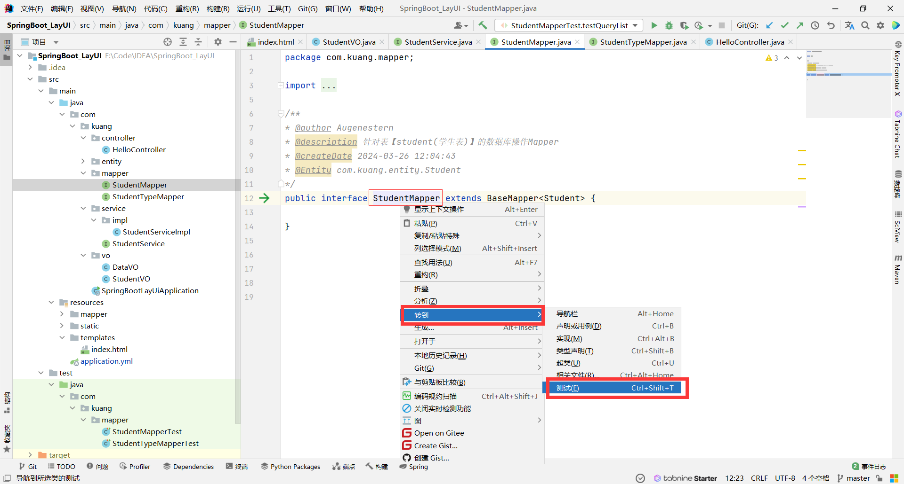

# 1、盘古踩坑积累


## 1.1、SpringBoot集成LayUI

在使用SpringBoot集成LayUI框架时，引入了`Thymeleaf`语法，遇到一个解析异常（`Could not parse as expression`）的错误。

LayUI 中的表格会经常性使用到`[[...]]`的表项，但是在`Thymeleaf`中会以为是要解析两个方括号里面的变量，就会造成冲突。

- 解决办法：禁用内联 `th:inline="none"`

> 参考：
>
> - [关于Could not parse as expression的报错](https://blog.csdn.net/sun8112133/article/details/107339009)
>
> - [Thymeleaf之内](https://sunkuan.blog.csdn.net/article/details/106991754)


## 1.2、IDEA连接MySQL8.0驱动无法下载问题

连接梯子下载，若是下载不成功需要手动下载jar包

1. 打开 cmd -> `mysql --version`，检查 mysql 版本

2. 进入`https://downloads.mysql.com/archives/c-j/` 下载对应 jar 包


3. [将jar包放入IDEA步骤](https://zhuanlan.zhihu.com/p/611646634)


> 参考：
>
> - [mysql-connector-java-8.0.26-bin.jar 包含bin的jar下载](https://blog.csdn.net/yxw22/article/details/120153117)


## 1.3、MyBatisX插件的配置信息


## 1.4、Springboot实体类配置Data类型指定格式

springboot项目中，如果声明一个@RestController 接口，如果返回有 Date格式的话，则前端通过http接收到的格式默认为`Tue May 24 2022 17:49:42`


我们要指定给前端返回的数据格式，有两种办法：

1. 第一种方法:在实体类的Data字段上加注解：` @JsonFormat(pattern="yyyy-MM-dd HH:mm:ss")`

```java
//配置日期写入格式 datatime:yyyy-MM-dd HH:mm:ss
@JsonFormat(pattern="yyyy-MM-dd HH:mm:ss")
private Date studentBirthday;
```


2. 第二种方法:在`application.yml`里面全局jackson序列化格式:

```yaml
spring:
  jackson:
    date-format: yyyy-MM-dd HH:mm:ss
    time-zone: GMT+8
```


## 1.5、关于IDEA2022开启热部署

1. `pom.xml`文件引入依赖

```xml
<dependency>
    <groupId>org.springframework.boot</groupId>
    <artifactId>spring-boot-devtools</artifactId>
    <optional>true</optional>
</dependency>
```


2. 构建项目


## 1.6、SpringBoot测试接口快捷

- 在要测试的接口右键 - 转到 - 测试




## 1.7、MapStructPlus与Lombok冲突

有时候会遇到Lombok的`@Data`注解不起作用，可以排查一下是否与 MapStruct、MapStructPlus 依赖冲突。

> 解决办法：[MapStructPlus与Lombok整合](https://easii.gitee.io/mapstruct-plus/guide/faq.html)

> 参考：[Spring @data 无作用](https://blog.csdn.net/baidu_32492845/article/details/86483518)


## 1.8、jetbrains产品集成Github令牌失败

在使用 jetbrains 产品集成Github令牌进行登录的时候也会出现链接失败的问题：

- 解决方法：打开如图代理


## 1.9、jetbrains产品修改git远程仓库地址

在使用 jetbrains 产品进行修改 git 远程仓库地址时，会出现一直连接不上远程仓库的问题，这个时候就需要通过 git 命令进行修改了。

1. 在进入项目文件夹的根目录下，右击选择【Git Bash Here】
2. 输入命令`git remote -v`，查看git的远程仓库库地址

```bash
git remote -v
```

3. 输入命令`git remote set-url origin 新地址`替换成新地址

```bash
git remote set-url origin 新地址
```

4. 可再次输入命令`git remote -v`查看是否更新成功

> 参考：https://blog.csdn.net/MagicalIT/article/details/128663614


## 1.10、解决Github port 443 : Timed out

在配置好如上进行代码推送，使用Clash开代理进行推送，会碰到443的问题。

解决方法：

1. 打开 设置 --> 网络与Internet --> 查找代理


如上图所示，地址与端口号为：127.0.0.1:7890

2. 修改 Git 的网络设置

```bash
# 注意修改成自己的IP和端口号
git config --global http.proxy http://127.0.0.1:7890 
git config --global https.proxy http://127.0.0.1:7890
```

> 其实主要解决的是为啥搭建了梯子依旧不好使的问题。
>
> 参考：
>
> - https://zhuanlan.zhihu.com/p/636418854


## 1.11、解决Webstrom不识别`@`别名

1. 设置 - 语言和框架 - JavaScript - Webpack


2. 在项目根目录下新建`webpack.config.js`

```javascript
const path = require('path')
 
module.exports = {
  context: path.resolve(__dirname, './'),
  resolve: {
    extensions: ['.js', '.vue', '.json'],
    alias: {
      '@/': path.resolve('src'),
    }
  }
}
```


这样就可以识别`@`别名路径啦！


