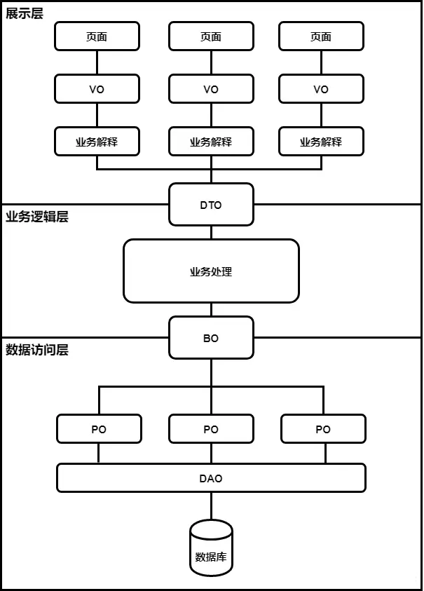

# 1、Java中POJO、PO、DTO、VO、domain的概念与区别

在Java开发中，POJO、PO、DTO、VO和BO是常见的概念，下面我们将逐一解释这些概念，并比较它们之间的区别。




## 1.1、PO、Entity、domain

**PO通常用于数据库操作，将数据库表中的记录映射到Java对象。**

- 数据表中的每个字段 一 一 对应 PO 的一个属性。
- PO == Entity，PO就是我们常说的实体类，持久化对象。

> [!INFO]
> 在entity、PO包下面的实体类其中的属性会和数据表中的数据类型一一对应，没有多也没有少
> 在domain包下面的实体类其中的属性不仅会包含数据库中的字段，还会包含其他自定义属性

```java
@Data
@AllArgsConstructor
@NoArgsConstructor
public class User {
    /**
     * 用户id
     */
    private Integer id;

    /**
     * 用户名
     */
    private String username;

    /**
     * 用户密码
     */
    private String password;

    /**
     * 对应用户名的中文名称
     */
    private String chName;


}
```


## 1.2、DTO

dto **前端传给后端,一般是封装前端发送过来的数据**


## 1.3、VO

vo **后端传给前端，一般是将后端返回给前端的数据封装成对象再返回**，对应于页面上需要显示的数据(表格)
- 用来和前端进行交互的数据类


## 1.4、总结

> [!INFO]
>  vo 和 dto 都是在实体的基础上增加、减少字段，加入自己的判断逻辑等
>  在entity包下面的实体类其中的属性会和数据表中的数据类型一一对应，没有多也没有少
>  在domain包下面的实体类其中的属性不仅会包含数据库中的字段，还会包含其他自定义属性
>  在vo包下面的实体类其中的属性与数据库并没有关系，而是用来和前端进行交互的数据类
>  在pojo包下面的实体类并没有严格定义，可以看做是entity、domain、vo的集合包


## 1.5、POJO

POJO**专指只有setter/getter/toString的简单类，包括DO/DTO/BO/VO等**


