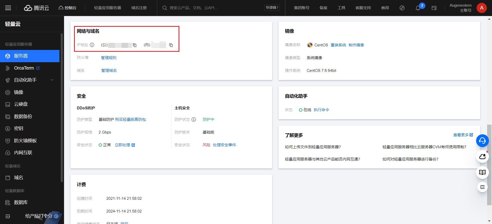

# 1、真实IP与虚拟IP(VIP)

真实ip是网络运营商提供的，不能随意变更。而虚拟ip，是用户自己设置的可以变更。

网站云服务器开通后，云服务商会配置ip，云服务器ip有**内网ip和外网（公网）ip**，下面介绍一下这两种ip的区别。

## 1.1、网络结构

如图，假设我们的计算机现在就是设备一，我们想要访问百度。

1. 如果我们正使用着校园网，那么首先我们需要先通过校园网的路由器把我们的内网ip转为校园网的外网ip。（NAT转换）
2. 然后通过这个外网ip先连接上湖南电信的网关，最后在连接上百度的网关。
3. 百度把你请求的信息回传到你的校园网网关，校园网网关再把信息传给你（整个网络呈网状结构，它会自动找到一条通往百度的路径——基于深度优先搜索或者广度优先搜索）

## 1.2、外网(公网)ip和内网ip

- 公网ip具有世界范围的唯一性，而内网ip只在局域网内部具有唯一性。
- **一个局域网里所有电脑的内网IP是互不相同的,但共用一个外网IP。**

