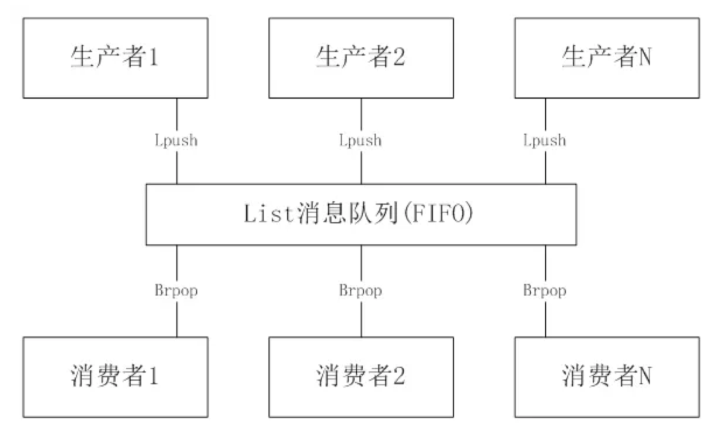
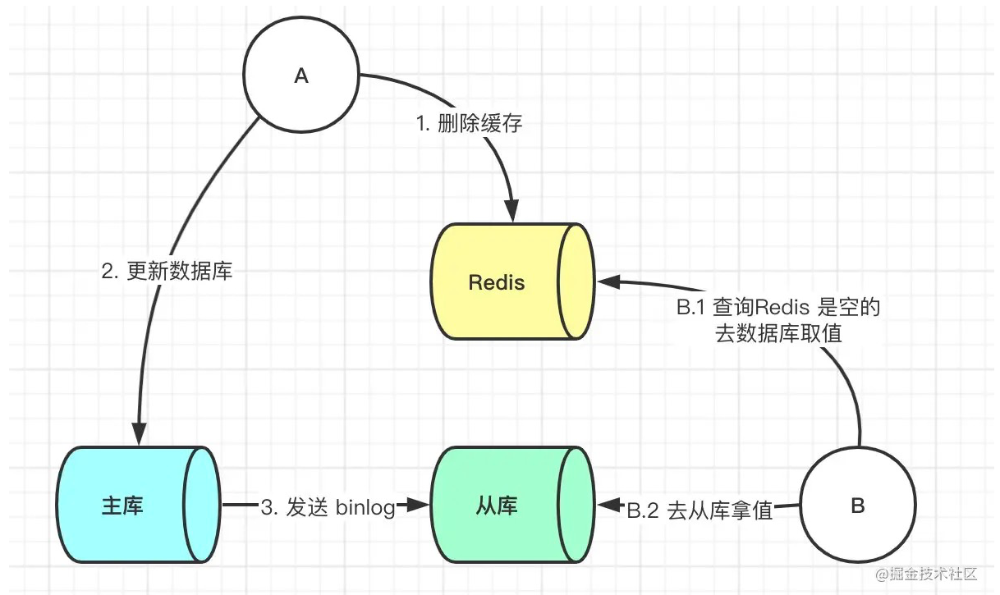

# 1、Redis

Redis是一个高性能的开源**内存数据库系统**，它使用键值对存储数据，并支持多种数据结构，如字符串、哈希、列表、集合和有序集合。与传统关系型数据库不同，Redis将数据存储在内存中，以实现快速读写操作。同时，它还提供持久化功能，可以将数据周期性地写入磁盘，以保证数据的持久性。

由于Redis的高性能和丰富的数据结构，它在许多应用场景中得以广泛应用。

- 例如，它可以用作**缓存系统**，将热门的数据存储在内存中，以提高读取速度。
- 此外，Redis还可以用作**消息队列**，实现异步任务处理和解耦系统组件。
- 在实时统计和计数方面，Redis也能很好地应用，例如实时在线用户数统计、访问频次计数等。


## 1.1、关系型数据库和非关系型数据库有什么区别

关系型数据库（RDBMS）和非关系型数据库（NoSQL）在数据存储和处理方面存在着一些区别。

1. 数据结构：关系型数据库使用表格结构（二维表）来组织数据，并且表格之间可以建立关系，即通过外键进行关联。而非关系型数据库采用不同的数据模型，如键值对、文档、列族、图等，没有固定的结构。
2. 扩展性：关系型数据库在处理海量数据时可能会面临性能瓶颈。而非关系型数据库设计用于处理大规模、高并发的数据，能够更好地水平扩展，可以通过添加更多的节点来提高系统的处理能力。
3. 灵活性：关系型数据库需要在设计阶段定义表结构，并且需要遵循预设的模式。一旦定义后，数据的修改可能会变得复杂。而非关系型数据库更加灵活，可以随着应用需求的变化进行数据结构的调整和扩展。
4. 事务支持：关系型数据库支持事务，可以保证数据的一致性和可靠性。非关系型数据库根据不同的类型和实现方式，事务支持程度可能有所不同。
5. 查询语言：关系型数据库使用结构化查询语言SQL来查询和操作数据。非关系型数据库则使用不同的查询语言或接口，如键值对数据库使用键来访问值，文档数据库使用类似JSON的查询语法。


## 1.2、非关系型数据库你还了解哪些

除了Redis之外，常见的非关系型数据库还有以下几种：

1. 文档数据库（Document Database）：文档数据库使用类似JSON的文档格式来存储数据，每个文档都可以包含不同的字段和值。MongoDB是一种著名的文档数据库，它适用于存储半结构化和动态模式的数据。
2. 列族数据库（Column-family Database）：列族数据库以列族为单位存储数据，每个列族包含多个列。列族数据库适用于大数据量的高吞吐量场景，例如日志分析和时间序列数据存储。HBase是一种常见的列族数据库。
3. 搜索引擎（Search Engine）：搜索引擎是一种特殊类型的非关系型数据库，用于支持全文搜索和复杂的查询。Elasticsearch和Solr是两个常用的搜索引擎，它们广泛应用于日志分析、数据搜索和实时数据分析等领域。


## 1.3、Redis 不适合什么应用场景呢

虽然Redis非常强大和灵活，但并非适合所有的应用场景。特定的场景下可能需要慎用Redis：

1. 大数据存储：Redis将所有数据存储在内存中，虽然这可以提供非常快的读写速度，但也限制了其数据存储量。如果需要存储的数据超过了机器的内存，或者你需要一个长期存储大量数据的方案，如历史数据分析，那么你可能需要考虑硬盘存储的数据库系统，比如MySQL或者Hadoop。
2. 关系型数据处理：如果你的应用需要处理复杂的关系型数据，并且需要执行复杂的SQL查询，那么使用关系数据库可能是更好的选择。因为Redis不支持执行SQL查询，而你可能需要使用例如MySQL这样的关系数据库。
3. 需要ACID事务的应用：虽然Redis有一定的事务处理能力，但没有提供像传统关系数据库那样的ACID（原子性、一致性、隔离性和持久性）事务支持。因此，对数据一致性有严格要求的应用，比如银行转账等，可能会倾向于使用支持ACID事务的数据库。


## 1.4、Redis 常见的数据类型有哪些

- **1. string 字符串**

字符串类型是 Redis 最基础的数据结构，首先键是字符串类型，而且其他几种结构都是在字符串类型基础上构建的。字符串类型实际上可以是字符串：简单的字符串、XML、JSON；数字：整数、浮点数；二进制：图片、音频、视频。

使用场景：缓存、计数器、共享 Session、限速。

- **2. Hash（哈希）**

在 Redis中哈希类型是指键本身是一种键值对结构，如 value={{field1,value1},……{fieldN,valueN}}

使用场景：哈希结构相对于字符串序列化缓存信息更加直观，并且在更新操作上更加便捷。所以常常用于用户信息等管理，但是哈希类型和关系型数据库有所不同，哈希类型是稀疏的，而关系型数据库是完全结构化的，关系型数据库可以做复杂的关系查询，而 Redis 去模拟关系型复杂查询开发困难且维护成本高。

- **3. List（列表）**

列表类型是用来储存多个有序的字符串，列表中的每个字符串成为元素，一个列表最多可以储存 2 ^ 32 – 1 个元素，在 Redis 中，可以队列表两端插入和弹出，还可以获取指定范围的元素列表、获取指定索引下的元素等，列表是一种比较灵活的数据结构，它可以充当栈和队列的角色。

使用场景：Redis 的 lpush + brpop 命令组合即可实现阻塞队列，生产者客户端是用 lpush 从列表左侧插入元素，多个消费者客户端使用 brpop 命令阻塞式的“抢”列表尾部的元素，多个客户端保证了消费的负载均衡和高可用性。



- **4. Set（集合）**

集合类型也是用来保存多个字符串的元素，但和列表不同的是集合中不允许有重复的元素，并且集合中的元素是无序的，不能通过索引下标获取元素，Redis 除了支持集合内的增删改查，同时还支持多个集合取交集、并集、差集。合理的使用好集合类型，能在实际开发中解决很多实际问题。

使用场景：如：一个用户对娱乐、体育比较感兴趣，另一个可能对新闻感兴趣，这些兴趣就是标签，有了这些数据就可以得到同一标签的人，以及用户的共同爱好的标签，这些数据对于用户体验以及曾强用户粘度比较重要。

- **5. zset（sorted set：有序集合）**

有序集合和集合有着必然的联系，它保留了集合不能有重复成员的特性，但不同得是，有序集合中的元素是可以排序的，但是它和列表的使用索引下标作为排序依据不同的是：它给每个元素设置一个分数，作为排序的依据。

使用场景：排行榜是有序集合经典的使用场景。例如：视频网站需要对用户上传的文件做排行榜，榜单维护可能是多方面：按照时间、按照播放量、按照获得的赞数等。


## 1.5、Zset 的底层是如何实现的

Redis的有序集合（Zset）是一种既可以看作是Set，又可以看作是Hash的数据结构，其底层实现主要使用了哈希表和跳跃表。

1. 哈希表：在Redis的Zset中，每个元素是唯一的，同时与每个元素关联的还有一个分数（Score）。元素的唯一性保证可以由哈希表来实现。即Redis的Zset将元素作为哈希表的键，将对应的分数作为哈希表的值。
2. 跳跃表：Redis的Zset还需要依据分数来对元素进行排序，这个特性是通过跳跃表来实现的。跳跃表是一种可以进行快速查找的数据结构。由于跳跃表的特性，对于分数的查找、插入、删除都具有较好的时间复杂度。

所以，Zset的基本形状就是：哈希表确保了成员的唯一性和查找的速度，跳跃表确保了有序性以及区间查找。


## 1.6、Redis 为什么这么快

Redis之所以能够具有高速的性能，主要是由于以下几个原因：

1. **数据存储在内存**：Redis将数据存储在内存中，而内存的读写速度比磁盘快几个数量级。这使得Redis可以快速响应读写操作，适合于对延迟要求较高的应用场景。
2. **单线程模型**：Redis采用单线程的方式来处理客户端请求。通过避免多线程之间的锁竞争和上下文切换，可以减少了不必要的开销，提高了处理效率。
3. **精简的数据结构和高效算法**：Redis提供了多种数据结构（如哈希、集合、有序集合等），这些数据结构在内部经过精心优化，使用了高效的算法，以提高执行效率。
4. **高效的网络通信**：Redis使用自己的协议进行网络通信（IO多路复用模型），协议简单且紧凑，减少了网络开销。此外，Redis还支持连接复用和连接池等机制，提高了网络通信的效率。

需要指出的是，虽然Redis在内存存储和单线程上具有高性能，但在数据量较大或复杂计算场景下，其性能仍然会受到一定限制。因此，在选择使用Redis时，需要考虑具体的应用需求和数据规模，综合评估其性能与可伸缩性。


## 1.7、什么是缓存穿透？怎么解决？

缓存穿透是指在使用缓存系统时，恶意请求或者不存在的数据频繁地被发送到缓存中，导致缓存无法命中，最终请求会直接落到后端数据库，造成数据库压力过大。

缓存穿透可能出现的原因包括：

1. 恶意攻击：攻击者有意发送不存在的数据请求，试图使缓存失效，以达到影响系统性能或者触发系统错误的目的。
2. 随机查询：大量并发的随机查询请求，其中大部分请求的数据都不存在于缓存中。
3. 存在但很少访问的数据：一些数据很少被访问，经常被请求但却不存在于缓存中，导致缓存穿透。

为了解决缓存穿透问题，可以采取以下措施：

1. 布隆过滤器（Bloom Filter）：布隆过滤器是一种高效的数据结构，用于判断某个元素是否存在于集合中。在请求到来时，先使用布隆过滤器进行判断，如果被拦截则不再继续访问缓存和数据库，减轻了数据库的压力。
2. 缓存空对象（Cache Null Object）：当某个请求查询的数据不存在时，将空对象或者null放入缓存，以防止相同的请求频繁查询数据库。在一定时间内，如果有相同的请求再次到来，则直接从缓存中获取到空对象，避免了对数据库的重复查询。
3. 数据预热（Cache Pre-warming）：在系统启动时，将一些常用或重要的数据预先加载到缓存中，提前热身缓存，避免了对这部分数据的缓存穿透问题。
4. 异步加载（Asynchronous Loading）：对于即将过期的缓存数据，可以在后台异步地进行数据加载和缓存的更新，避免了数据过期期间的缓存穿透。
5. 限流和防护机制：通过对请求进行限流、IP白名单校验和请求验证等手段，防止恶意攻击和异常流量对缓存系统造成压力。

综合采取上述措施可以有效应对缓存穿透问题，提高系统的性能和稳定性。


## 1.8、什么是缓存雪崩？该如何解决？

缓存雪崩是指在缓存中大量的缓存数据同时过期或者缓存服务器宕机，导致大量请求直接访问后端数据库，造成数据库压力过大，甚至引发系统崩溃。

缓存雪崩可能出现的原因包括：

1. 缓存数据同时过期：在某个时间点，大量的缓存数据同时过期，导致大量请求落到后端数据库。
2. 缓存服务器宕机：缓存服务器突然宕机或者故障，导致所有请求无法访问缓存，直接访问后端数据库。

为了解决缓存雪崩问题，可以采取以下措施：

1. 设置缓存失效时间的随机性：在设置缓存失效时间时，可以为不同的缓存设置不同的失效时间，以避免大量数据在同一时间内同时失效。可以在原有失效时间的基础上加上一个随机的时间，使得失效时间分散化。

   

2. 使用热点数据永不过期：对于一些热点数据，可以将其缓存设置为永不过期，以保证热点数据在任何时候都可以快速访问，避免因过期导致的缓存雪崩。

3. 实时监控和预警：监控缓存系统的状态和数据过期情况，及时发现异常并采取相应的措施，例如提前进行缓存的更新操作，或者在缓存失效前主动将其刷新。

4. 备份缓存服务：部署多个独立的缓存服务器，以充分利用缓存的高可用性。如果一个缓存服务器出现故障，其他服务器仍然可以继续提供缓存服务。

5. 数据预热：在系统启动时，将一些常用或重要的数据预先加载到缓存中，提前热身缓存，减少冷启动时缓存雪崩的风险。

6. 限流和熔断机制：对缓存系统进行限流控制，可以设置最大并发数、最大请求时间等，以及在缓存故障时启用熔断机制，防止大量请求直接落到后端数据库。

综合采取上述措施可以有效应对缓存雪崩问题，保证系统的稳定性和可靠性。


## 1.9、什么是缓存击穿？如何解决？

缓存击穿是指当缓存中没有某个key的数据，这当然会导致缓存无法命中，然后请求就会穿透缓存层，直接访问数据库。如果这个不命中的请求不止一个，而是成千上万个同时发生，那么就会对数据库形成巨大的访问压力，可能会导致数据库访问瞬间崩溃。

最常见的缓存击穿场景就是有大量请求同时查询一个热点key，但是此时缓存中该key的数据刚好过期，于是大量的请求就会直接穿透到数据库。

针对缓存击穿问题，常见的解决方案有：

1. **设置热点数据永不过期**：这种方法适用于某些更新不频繁但是访问非常频繁的热点数据。
2. **缓存数据过期时间设置随机**，防止同一时间大量数据过期现象发生。
3. **使用互斥锁（Mutex key）**：对于同一个key，只允许一个线程去加载数据，其他线程等待加载完成直接使用即可。
4. **服务降级与熔断**：如果数据库压力过大，可以暂时拒绝部分请求，让系统在承受的压力范围内运行。


## 1.10、布隆过滤器的原理是什么？它的优点是什么？缺陷是什么？

布隆过滤器（Bloom Filter）是一种数据结构，用于快速判断一个元素是否属于一个集合，它的原理、优点和缺陷如下：

**原理**：

1. 哈希函数：布隆过滤器使用多个哈希函数（通常是非加密哈希函数），将输入元素映射成多个不同的位数组索引。
2. 位数组：布隆过滤器内部维护一个位数组，所有位的初始值都为0。
3. 添加元素：当要将一个元素添加到布隆过滤器中时，对该元素应用多个哈希函数，然后将相应位数组索引位置的位设置为1。
4. 查询元素：当要查询一个元素是否存在于布隆过滤器中时，同样对该元素应用多个哈希函数，检查相应位数组索引位置的位是否都为1。如果所有位都为1，则可能存在；如果有任何一位为0，则一定不存在。

**优点**：

1. 节省内存：相比于使用散列表或集合等数据结构，布隆过滤器占用的内存较少，因为它只需要维护位数组。
2. 快速查询：布隆过滤器的查询操作非常快速，通常只需要几个哈希函数的计算和位的检查。
3. 可用于大规模数据：适用于处理大规模数据集，尤其是在内存有限的情况下，可以快速过滤掉大部分不可能存在的元素，减轻后续查询的压力。

**缺陷**：

1. 误判率：布隆过滤器可能会产生误判，即判断一个元素存在时，实际上它可能不存在。这是因为多个元素可能映射到相同的位数组索引，导致冲突。
2. 不支持删除：由于布隆过滤器的位数组只能设置为1，不能删除元素。如果需要删除元素，需要重新构建布隆过滤器。
3. 容量不可扩展：一旦位数组的大小确定，就不能动态扩展，因此需要在设计时估计好位数组的大小以应对数据规模的增长。

总之，布隆过滤器是一种高效的数据结构，适用于需要快速过滤数据的场景，但要注意其误判率和不支持删除的特点。


## 1.11、介绍一下 RDB 持久化？

RDB（Redis Database）持久化是Redis提供的一种数据持久化方法，它可以将内存中的数据以二进制的形式写入磁盘，以保证数据在重启或者异常情况下的持久性。

RDB持久化工作原理：

1. 快照生成：当触发RDB持久化时，Redis会将当前内存中的数据通过fork()系统调用创建一个子进程，由子进程负责在后台进行快照生成。
2. 数据存储：子进程会将内存中的数据按照指定的数据结构和格式保存到一个临时文件中。
3. 替换原文件：当持久化过程结束后，子进程会将临时文件替换原有的RDB文件。
4. 恢复数据：在Redis重启的时候，会通过加载RDB文件将数据重新读入内存中。

RDB持久化的优点：

1. 性能高：由于是在后台进行持久化操作，不会阻塞主线程，所以对Redis的性能影响较小。
2. 容灾性强：通过RDB文件，可以将数据备份到磁盘中，保证数据在异常情况下的可恢复性。

RDB持久化的缺点：

1. 数据丢失：由于RDB持久化是通过生成快照的方式进行的，如果Redis在最后一次持久化之后发生故障，会导致最后一次持久化之后的数据丢失。
2. 时效性：RDB持久化是定期执行的，数据的持久化是在配置的时间间隔之后，因此在发生故障之前的数据可能会丢失。

需要注意的是，RDB持久化机制适合用于数据备份、数据迁移等场景，但对于实时性要求较高的应用（如消息队列），可能不适合使用RDB持久化。此时，可以考虑使用AOF（Append Only File）持久化机制。


## 1.12、介绍一下 AOF 持久化？

AOF（Append Only File）持久化是Redis提供的另一种数据持久化方法。通过AOF持久化，Redis将写操作追加到一个文件中，以保证数据在重启或者异常情况下的持久性。

AOF持久化工作原理：

1. 追加写操作：当有写操作（增删改）发生时，Redis会将这些写操作以文本的形式追加到AOF文件末尾。
2. 文件同步：Redis会通过fsync()系统调用将AOF文件的内容强制刷写到磁盘上，以保证数据的持久性。可以通过配置`appendfsync`参数来调整同步频率，可以选择每次写入都同步（always）、每秒同步一次（everysec）或者操作系统自行决定（no）。
3. 文件重写：当AOF文件变得过大时，可以通过BGREWRITEAOF命令触发AOF文件的重写。Redis会启动一个子进程，将当前内存中的数据重写到一个新的AOF文件中，并且优化写入操作，减小AOF文件的体积。
4. 恢复数据：在Redis重启的时候，会通过加载AOF文件中保存的写操作来恢复数据，重建内存中的数据状态。

AOF持久化的优点：

1. 数据可靠性高：AOF持久化记录了写操作的历史记录，因此在异常断电或者重启时，可以通过AOF文件将数据快速恢复，避免了数据丢失的风险。
2. 数据实时性高：相比于RDB持久化的定期快照记录，AOF持久化会实时追加写操作到AOF文件中，因此对于实时性要求较高的应用场景更为适合。
3. 可读性好：AOF文件以纯文本形式记录写操作，可以直接查看和修改AOF文件，方便进行恢复和数据分析。

AOF持久化的缺点：

1. 文件体积较大：由于AOF记录了所有的写操作历史，因此AOF文件会比RDB文件大，可能会占据更多的磁盘空间。
2. 写入操作耗时：由于每次写操作都需要追加到AOF文件中，相比于RDB持久化，AOF持久化会有一定的写入延迟，可能会影响Redis的性能。
3. 文件重写需要时间：当AOF文件变得过大时，进行AOF文件的重写是一项耗时的操作，可能会对Redis的性能产生一定影响。

需要根据具体的应用场景和需求，权衡使用AOF持久化还是RDB持久化，或者同时使用两种持久化方式来保证数据的可靠性和性能。


## 1.13、Redis默认采用哪个持久化方式？

Redis默认采用的持久化方式是RDB（Redis Database）持久化。在默认配置下，Redis将周期性地将内存中的数据生成快照并写入磁盘，以保证数据的持久性。

RDB持久化通过将数据以二进制的形式保存到磁盘的RDB文件中，包含了Redis数据的全量快照。可以通过配置文件中的`save`参数来设置快照生成的条件，比如在指定的时间间隔内、指定的写操作次数等。


## 1.14、Redis 内存淘汰策略有哪些？

Redis提供了一些策略，以便在届满最大内存限制时进行内存淘汰：

1. noeviction：当内存不足以容纳更多数据时，新的写入操作会报错。这是默认策略。

   

2. allkeys-lru：在内存不足时让位于新值内容的，是最近最少使用的键（LRU：Least Recently Used）。

3. volatile-lru：在设置了过期时间的键中，淘汰最近最少使用的键，新的写入操作会报错。

4. allkeys-random：在内存不足时随机删除某个键的值，为新值让出空间。

5. volatile-random：在设置了过期时间的键中，随机淘汰一些键。

6. volatile-ttl：在设置了过期时间的键中，有更早过期时间的键优先被淘汰。

选择哪种策略取决于你的特定应用。如果你的程序可以接受偶发的性能下降，allkeys-lru可能是一个好选择。如果你知道一些键是可以安全删除的，你可以为它们设置过期时间，然后使用volatile-lru。如果数据的重要性不等，你可以为重要的数据设置过期时间，然后使用volatile-ttl策略。


## 1.15、Redis过期键的删除策略

Redis使用过期键的删除策略来自动清除已经过期的键，以释放内存空间。Redis采用了多种策略来删除过期键，具体的删除策略由配置参数`eviction`决定，常见的策略包括：

1. 定期删除策略（定时删除）：Redis会在每个指定的时间间隔（由配置参数`hz`决定）内，检查一批键是否过期，然后删除过期的键。这种策略不会频繁地检查每个键是否过期，因此对CPU的消耗较少。
2. 惰性删除策略（懒汉式删除）：当访问某个键时，Redis会先检查该键是否过期，如果过期则立即删除。这种策略相对更加高效，因为它只会在需要时才进行检查和删除操作。
3. 定期删除与惰性删除的结合：Redis同时使用了定期删除和惰性删除两种策略，在有限的时间间隔内通过定期删除来批量清除过期键，同时在读写操作中使用惰性删除来保证及时的清理。

需要注意的是，无论采用哪种删除策略，Redis并不是立即清除过期键，而是通过在查询和写入操作时进行过期键的检查和删除。因此，在过期时间到达之后，过期键可能仍然存在一段时间，直到Redis执行删除操作。如果需要确保即时删除过期键，可以使用`DEL`命令主动删除过期键。

同时，可以通过配置参数`maxmemory`来限制Redis使用的内存大小，当达到内存限制时，Redis会根据所采用的删除策略来淘汰一些数据以释放内存空间。


## 1.16、如果Redis的数据不小心设置了永不过期，会发生什么

如果Redis的数据被设置为永不过期（即不设置过期时间或过期时间设置为0），会导致以下几个问题：

1. 内存占用高：Redis是基于内存的数据库，将数据保留在内存中，如果数据被设置为永不过期，那么它将一直占用内存，从而导致内存消耗过高。当Redis的内存使用超过硬件限制或者Redis配置的最大内存限制时，可能会导致Redis崩溃或无法正常工作。
2. 数据不一致：如果某个数据被设置为永不过期，那么即使数据本身已经过时或者无效，它仍然留存在Redis中。这可能导致缓存中的数据与实际数据不一致，从而影响应用程序的正确性和一致性。
3. 数据淘汰问题：当Redis达到配置的最大内存限制时，会触发数据淘汰机制来释放内存。如果数据被设置为永不过期，那么这些数据可能无法被淘汰，从而导致Redis无法进行数据淘汰，进一步危及系统的运行稳定性。

为了避免上述问题，建议在使用Redis时，谨慎设置数据的过期时间，确保合理的数据存储和内存管理。对于一些本身无法设置过期时间的重要数据，可以通过其他机制（如主动更新、监控等）来保证数据的有效性和一致性。


## 1.17、Redis 哈希表扩容介绍一下？

Redis的哈希表扩容是指在哈希表需要增加更多的槽位（bucket）来存储元素时进行的一种扩展机制。当哈希表中的元素数量增加到一定阈值时，Redis会自动触发哈希表的扩容操作。

哈希表扩容的过程如下：

1. 新建更大的空白哈希表：Redis会创建一个更大的空白哈希表，其槽数量通常是当前哈希表槽数量的两倍。
2. 搬移数据：Redis逐个遍历原哈希表中的每个槽位，将非空的槽位中的元素重新计算哈希值，然后放入新的哈希表的对应槽位中。这个过程称为rehash。
3. 渐进式地迁移数据：为了避免一次性大量数据的搬移导致系统的延迟，Redis采用渐进式的方式进行数据迁移。每次执行rehash操作时，Redis只处理一小部分槽位，并渐进地将数据从原哈希表迁移到新哈希表中。
4. 更新指针和释放内存：当新哈希表中的rehash操作完成后，Redis会将指向原哈希表的指针更新为新哈希表，并释放原哈希表所占用的内存。

需要注意的是，在哈希表进行扩容期间，Redis会同时维护原哈希表和新哈希表，保证数据的正常访问。在数据迁移过程中，读取操作会同时访问两个哈希表，写入操作会先写入新哈希表，并同时更新两个哈希表，以确保数据的一致性。

哈希表扩容是Redis动态调整内存空间的关键机制之一，它通过增加槽位来适应数据的增长，保证了哈希表的性能和容量。同时，由于采用了渐进式的迁移策略，在数据量较大情况下也能较好地控制系统的稳定性和延迟


## 1.18、Hash 冲突怎么办？

Redis 通过**链式哈希**解决冲突：**也就是同一个 桶里面的元素使用链表保存**。但是当链表过长就会导致查找性能变差可能，所以 Redis 为了追求快，使用了两个全局哈希表。用于 rehash 操作，增加现有的哈希桶数量，减少哈希冲突。

开始默认使用 「hash 表 1 」保存键值对数据，「hash 表 2」 此刻没有分配空间。当数据越来越多触发 rehash 操作，则执行以下操作：

1. 给 「hash 表 2 」分配更大的空间；
2. 将 「hash 表 1 」的数据重新映射拷贝到 「hash 表 2」 中；
3. 释放 「hash 表 1」 的空间。

**值得注意的是，将 hash 表 1 的数据重新映射到 hash 表 2 的过程中并不是一次性的，这样会造成 Redis 阻塞，无法提供服务。**

而是采用了**渐进式 rehash**，每次处理客户端请求的时候，先从「 hash 表 1」 中第一个索引开始，将这个位置的 所有数据拷贝到 「hash 表 2」 中，就这样将 rehash 分散到多次请求过程中，避免耗时阻塞。


## 1.19、如何实现数据尽可能少丢失又能兼顾性能呢？

Redis通过使用不同的数据持久化策略来在数据安全性和性能之间进行权衡，包括RDB和AOF（Append Only File），以及二者的组合使用。

1. RDB持久化可以定期将当前的数据快照（snapshot）写入磁盘。比如你可以设置Redis每隔5分钟就把当前内存中的数据生成一次快照，存入硬盘。但这种方式可能会造成最近几分钟内的数据丢失。举例来说，假设你的系统在10:00做了一次快照，在10:05时 Redis服务器突然宕机，那么你就会丢失10:00到10:05这五分钟内的数据。
2. AOF（Append Only File）持久化每当数据改变时都会将命令追加到AOF文件中。当Redis重新启动时，会通过重新执行AOF文件中的命令来恢复数据。AOF方式通过记录每一条修改数据库的命令来保证数据的强一致性，即使在系统崩溃的情况下，数据的确保也仍然有保障。在默认配置中，Redis每秒钟fsync一次AOF文件，即使发生故障也只会丢失一秒钟的数据。
3. RDB和AOF的组合使用。为了同时拥有RDB和AOF各自的优点，实际中我们也可以同时开启两者。数据恢复首选AOF，当AOF出问题时，再使用RDB恢复。这样既保证了数据的安全性也保证了性能。

通过灵活地配置RDB的快照频率以及AOF的写入硬盘频率，Redis可以实现既保证数据安全性也兼顾性能的效果。默认情况下Redis已经对这两者进行了较好的配置，当然根据你的实际业务需求，你也可以自行进行修改。

例如，一个用户会话状态存储可以选择RDB做持久化，即使Redis崩溃重启，丢失几分钟的用户状态影响也是相对较小。而在支付系统等对数据强一致性要求非常高的场合，则需要优先使用AOF做持久化，减少由于Redis崩溃导致的数据损失。


## 1.20、Redis如何做内存优化？

Redis有几种方法可以进行内存优化：

1. 数据结构选择：Redis提供了多种数据结构，如字符串、列表、哈希、集合、有序集合等。针对不同的应用场景，选择合适的数据结构可以有效地减少内存占用。例如，如果某个数据集合使用列表存储，但实际上只需要存储唯一值，那么使用集合数据结构可以减少重复数据，从而节省内存。
2. 优化键名：键名在Redis中也是占用内存的一部分，特别是当键名较长时。优化键名可以有效减少内存消耗。例如，使用较短的键名、避免重复前缀等。
3. 压缩数据：对于存储的数据，可以考虑使用压缩算法对其进行压缩。Redis提供了对字符串类型的数据进行压缩的功能，在一些场景下可以显著减少内存占用。
4. 删除过期键：通过设置键的过期时间，可以使Redis自动删除过期的键，释放内存空间。合理设置过期时间，及时删除不再需要的数据，是非常重要的内存优化手段。
5. 配置内存淘汰策略：当内存超出设定的阈值时，Redis可以使用内存淘汰策略来回收部分内存。常见的淘汰策略有LRU（最近最少使用）、LFU（最不经常使用）和随机淘汰等。通过合理选择淘汰策略，可以按照业务需求和数据访问模式来优化内存使用。
6. 分区数据：如果数据集非常大，单个Redis实例无法承载，可以将数据进行分区存储到多个Redis实例中。这样可以将数据均匀分布到多个节点，减轻单个实例的内存压力。


## 1.21、怎么保证缓存和数据库数据的一致性？

1. 数据一致性问题主要发生在数据更新时。无论是先更新数据库再删除缓存，还是先删除缓存再更新数据库，都可能导致数据不一致。
2. 例如：如果删除了缓存但还未更新数据库，另一个线程读取数据时会发现缓存为空，从数据库读取旧数据并写入缓存，导致缓存中存在脏数据。如果先更新数据库但在删除缓存前线程宕机，缓存中仍保留旧数据，导致数据不一致。

> **答案一：延时双删**：延时双删策略是在写库前后都进行两次删除缓存操作，并设定合理的超时时间。伪代码如下：
>
> ```java
> public void write(String key, Object data) {
>     redis.delKey(key); // 删除缓存
>     db.updateData(data); // 更新数据库
>     Thread.sleep(500); // 休眠500毫秒
>     redis.delKey(key); // 再次删除缓存
> }
> ```
>
> 这种策略确保了在写请求完成后，读请求造成的缓存脏数据被删除。休眠时间需要根据读数据业务逻辑的耗时来确定。

（1）先淘汰缓存
（2）再写数据库（这两步和原来一样）
（3）休眠500毫秒，再次淘汰缓存，这么做，可以将1秒内所造成的缓存脏数据，再次删除。确保读请求结束，写请求可以删除读请求造成的缓存脏数据。

如果使用的是 Mysql 的读写分离的架构的话，那么其实主从同步之间也会有时间差。



此时来了两个请求，请求 A（更新操作） 和请求 B（查询操作）

1. 请求 A 更新操作，删除了 Redis
2. 请求主库进行更新操作，主库与从库进行同步数据的操作
3. 请 B 查询操作，发现 Redis 中没有数据
4. 去从库中拿去数据
5. 此时同步数据还未完成，拿到的数据是旧数据

此时的解决办法就是如果是对 Redis 进行填充数据的查询数据库操作，那么就强制将其指向主库进行查询。


## 1.22、Redis为啥要选择单线程？

Redis选择单线程模型主要是基于以下考虑：

1. **简单性和清晰性**: 单线程模型会使Redis的设计和实现变得简单、清晰。无需担心各种复杂的同步、数据一致性和线程通信问题。这也大大提高了Redis的稳定性。
2. **避免上下文切换开销**: 多线程和多进程程序需要频繁地进行系统调用，例如创建线程、进程间通信、上下文切换等。这些操作相对于Redis的内存操作来说，CPU时间开销是巨大的。
3. **CPU瓶颈不是Redis的性能瓶颈**: Redis是基于内存的数据库，所以主要的性能瓶颈在于网络I/O和磁盘I/O，而不在CPU。通过使用单线程模型，Redis可以充分利用单核CPU的性能，而避免了线程切换和锁竞争的开销。
4. **高效的事件驱动模型**: Redis使用高效的事件驱动模型，即使是单线程也能处理高并发的网络连接和请求。

到目前为止，虽然Redis是单线程模型，但是其性能一直很高，可以支持每秒处理上百万次的读或者写操作。

当然，从某种角度来说，Redis并非完全的单线程。比如在进行RDB、AOF持久化以及主从复制的时候，Redis就会创建新的子进程。但这种方式不会引发复杂的数据的同步和一致性问题。


## 1.23、Redis 6.0为何引入多线程

- 虽然Redis的主要操作仍然是单线程执行的，但是在Redis 6.0版本中，它引入了多线程来处理某些特定的任务，特别是网络I/O的处理。这是因为随着硬件和网络技术的发展，多核处理器和高速网络已经变得普遍，对于CPU密集型的服务来说，单线程可能无法充分利用这些资源。

- 具体来说，在Redis 6.0中，主线程负责执行命令，而额外的IO线程则用来处理客户端和服务器之间的数据交换，包括接收请求和发送响应。这样做的好处是可以充分利用多核处理器，同时还能减少因网络I/O阻塞导致的处理速度下降。

- 需要注意的是，这些I/O线程并不会直接处理Redis命令，执行命令仍然是单线程的。只是在读取客户端请求和发送响应的时候使用了多线程处理。这样在提升吞吐量的同时，避免了多线程编程中数据一致性和同步问题的复杂性。

- 此外，Redis 6.0版中的多线程默认是关闭的，需要在Redis的配置文件中手动开启。


## 1.24、Redis6.0引入多线程，是否会有线程安全问题

- 在Redis 6.0中引入的多线程功能主要处理的是网络I/O任务，例如读取客户端请求和发送响应，执行命令的操作仍然是由主线程单独处理的，不涉及多线程。由于读取请求与发送响应这两个步骤大部分都与实际的数据处理过程（执行命令）是解耦的，因此并不会引起线程安全问题。
- Redis已经非常小心地保证了这种结构下的线程安全。在主线程分派任务给I/O线程进行处理，在I/O线程没有完成其任务之前，主线程是会等待的。同时，I/O线程之间并不会共享状态，也就没有竞争条件。
- Redis的这种使用多线程的方式并不会引入一般多线程编程中的复杂性和需要处理的并发问题，比如数据竞争和死锁。因为实际处理数据的只有一个主线程，而I/O线程仅用于处理网络任务，Redis内部的数据结构并不会在多个线程之间共享。


## 1.25、谈一谈你对Redis事务的理解？

Redis事务是一种将多个命令请求打包，一次性、按顺序地执行所有命令的机制，主要包括以下几个命令：

1. `MULTI`：标记一个事务块的开始。
2. `EXEC`：执行所有事务块内的命令。
3. `DISCARD`：取消事务，放弃执行事务块内的所有命令。
4. `WATCH`：监视键，如果键的值在事务执行之前发生改变，事务队列中的命令就不会执行。

值得注意的是，Redis的事务与传统意义上的数据库事务略有不同。在传统数据库中，事务有所谓的ACID属性——原子性、一致性、隔离性、持久性。但在Redis中，只支持命令的原子性，即事务队列中的命令会作为一个原子连续、中断地执行，执行过程中不会被其他命令插入。但是，如果事务队列中的某个命令执行失败，Redis并不会回滚其他已经执行的命令。

关于应用场景，比如我们在电商网站中，用户下单购买商品，这个过程可能包括修改商品库存、记录用户订单、更新用户账户余额等操作，我们可以放入一个Redis事务中，确保这些操作要么全部成功，要么全部不执行，保证数据的一致性。


## 1.26、Redis事务是否支持回滚？

- 在 Redis 中，事务是不支持回滚的。一旦调用 EXEC 命令执行事务，其中的所有命令都会被按顺序执行，并且不会发生回滚。即使在事务中某个命令执行失败，也不会影响其他命令的执行。

- 在 Redis 中，事务的执行过程类似于原子性的批处理，其中的每个命令都会按照顺序执行。如果其中的某个命令执行失败，Redis 会继续执行剩余的命令，并将失败的命令的错误信息返回给客户端。
- 由于 Redis 是单线程的，它不支持在事务中进行回滚操作，即无法撤销已经执行的命令。


## 1.27、为什么要做Redis分区？

Redis分区是将数据分散存储到多个Redis实例中的技术，它主要有以下几个原因：

1. **可扩展性**：Redis随着数据量的增长或负载的增加，单个实例可能无法承载更多数据或处理更多请求。通过分区，可以将数据分散到多个实例中，每个实例只承载部分数据和请求负载，从而实现更好的可扩展性。
2. **负载均衡：** 分区可以将数据和请求分散到多个Redis实例中，实现负载均衡。每个实例只处理部分请求，有效地分摊了整体负载，提高了性能和吞吐量。
3. **并行处理：** 在分区下，每个Redis实例都工作在独立的线程或进程中，可以同时处理来自不同客户端的请求。这样可以利用多核处理器的优势，提高并发处理能力。
4. **高可用性：** 通过使用分区，可以实现数据的冗余备份。当某个实例不可用时，分区可以保证其他实例仍然可用，从而提高系统的可用性。
5. **降低内存压力：** 如果数据集非常大，单个Redis实例内存无法承载，分区可以将数据分散到多个实例中，每个实例只需处理部分数据，减轻了单个实例的内存压力。

需要注意的是，Redis分区也带来了一些挑战。例如，分区后的数据访问变复杂，需要处理数据一致性、跨节点的事务和查询等问题。


## 1.28、你知道有哪些Redis分区实现方案？

有以下几种常见的Redis分区实现方案：

1. **客户端分区（Client-side Sharding）**：客户端负责将数据分散到多个Redis实例，以及根据数据分布将请求路由到正确的实例。客户端可以使用一致性哈希算法或其他分区算法来确定数据在哪个实例上存储，并直接与相应的实例进行通信。这种方案灵活，但需要在客户端代码中实现分区逻辑。
2. **代理分区（Proxy-based Sharding）：** 在这种方案中，引入Redis代理作为中间层，代理负责将数据分散到多个Redis实例，并将客户端请求路由到相应的实例。代理负责处理客户端与实例之间的通信，实现了透明的分区。代理分区方案可以使用Twemproxy、Redis Cluster Proxy等代理工具来实现。
3. **Redis Cluster（Redis集群）：** Redis Cluster是Redis官方提供的分区解决方案，它将数据分散到多个节点中，并提供了自动分区和故障转移的功能。Redis Cluster使用哈希槽分区算法将数据分配到不同的节点，并使用Gossip协议进行节点间的数据同步和故障检测。Redis Cluster提供了高可用性和自动扩展的功能，但需要Redis 3.0及以上版本的支持。
4. **虚拟分区（Virtual Sharding）：** 虚拟分区方案基于Redis的数据类型特性，将数据按照一定的规则分散到多个实例上，每个实例只负责一部分数据的存储。例如，可以使用哈希函数取模运算将数据分配到不同的实例。这种方案不需要额外的代理或客户端代码，但需要在应用层实现逻辑来根据键名将请求路由到正确的实例。虚拟分区常用于读写分离的场景，如将写请求路由到一个主实例，读请求路由到多个从实例。


## 1.29、在Redis中，如果Key太大了，容易出现什么问题？

在Redis中，如果key的值过大，可能会出现以下几个问题：

1. 内存问题：Redis全量数据存储在内存中，如果key值过大，过多，会消耗大量内存资源，可能导致Redis实例内存溢出，甚至导致实例崩溃。
2. 网络问题：Redis是基于Client-Server模型的网络应用，数据需要在网络中进行传输。如果数据项过大，那么网络传输会占用更多时间，对于对时效性有要求的业务情况下会造成延迟，影响用户体验。
3. CPU问题：当key很大时，Redis在处理HASH这类数据结构的时候，计算hash值，寻找key所在位置等都会消耗更多CPU资源。

为了避免这些问题，一般建议对Redis的key，以及对应的value做适当的设计和限制，使其既能满足业务需要，又不会导致资源过度消耗。例如，对于一些大文本或者图片等资源，可以选择在其他地方存储（如数据库或者文件系统），然后将其ID或者访问路径作为其对应的value存储在Redis中。


## 1.30、什么是缓存预热?

缓存预热是指系统上线后，提前将相关的缓存数据加载到缓存系统。避免在用户请求的时候，先查询数据库，然后再将数据缓存的问题，用户直接查询事先被预热的缓存数据。

如果不进行预热，那么Redis初始状态数据为空，系统上线初期，对于高并发的流量，都会访问到数据库中， 对数据库造成流量的压力。

缓存预热解决方案：

- 数据量不大的时候，工程启动的时候进行加载缓存动作；
- 数据量大的时候，设置一个定时任务脚本，进行缓存的刷新；
- 数据量太大的时候，优先保证热点数据进行提前加载到缓存。


## 1.31、什么是缓存降级？

缓存降级是一种在应用程序中应对高负载或缓存故障的策略。它是指当缓存服务不可用或性能下降时，应用程序主动放弃或减少对缓存的依赖，并通过其他途径来获取数据，以确保系统的可用性和稳定性。

缓存降级的主要目的是在缓存不可用或缓存命中率较低的情况下，仍能够提供基本的功能和服务。应用程序可以采取以下策略进行缓存降级：

1. 默**认值或备用数据**：当缓存不可用时，应用程序可以返回预先定义的默认值或备用数据，以避免出现错误。这可能是一些静态数据或使用其他数据源/服务获取的数据。
2. **直接访问数据库：** 缓存降级时，应用程序可以直接访问数据库来获取数据。尽管这可能会增加数据库的负载，但可以确保数据的可用性。
3. **限制功能：** 在缓存不可用的情况下，应用程序可以临时禁用一些不太重要或性能敏感的功能，以减轻系统的负载和压力。
4. **时效性降级：** 在高负载时，应用程序可以降低某些数据的缓存时效性，例如增加缓存的过期时间或减少缓存的更新频率。这样可以减少对缓存的访问，降低对缓存的依赖。
5. **服务熔断：** 在缓存故障或性能下降时，应用程序可以暂时关闭对缓存的请求，避免无效的等待。这可以避免请求在缓存服务不可用时长时间阻塞。

缓存降级是一个权衡和应对缓存故障的策略，它可以在一些不太关键的业务场景下提供一致的服务，并保证系统的可用性和稳定性。


## 1.32、Redis分布式锁如何实现？

分布式锁的三个核心要素

**1、加锁**

使用setnx来加锁。key是锁的唯一标识，按业务来决定命名，value这里设置为test。

```java
setx key test
```

Java

Copy

当一个线程执行setnx返回1，说明key原本不存在，该线程成功得到了锁；当一个线程执行setnx返回0，说明key已经存在，该线程抢锁失败；

**2、解锁**

有加锁就得有解锁。当得到的锁的线程执行完任务，需要释放锁，以便其他线程可以进入。释放锁的最简单方式就是执行del指令。

```java
del key
```

Java

Copy

释放锁之后，其他线程就可以继续执行setnx命令来获得锁。

**3、锁超时**

锁超时知道的是：如果一个得到锁的线程在执行任务的过程中挂掉，来不及显式地释放锁，这块资源将会永远被锁住，别的线程北向进来。

所以，setnx的key必须设置一个超时时间，以保证即使没有被显式释放，这把锁也要在一段时间后自动释放。setnx不支持超时参数，所以需要额外指令，

```java
expire key 30
```

Java

Copy

**上述分布式锁存在的问题**：

通过上述setnx 、del和expire实现的分布式锁还是存在着一些问题。

**1、SETNX 和 EXPIRE 非原子性**

假设一个场景中，某一个线程刚执行setnx，成功得到了锁。此时setnx刚执行成功，还未来得及执行expire命令，节点就挂掉了。此时这把锁就没有设置过期时间，别的线程就再也无法获得该锁。

**解决措施:**

由于setnx指令本身是不支持传入超时时间的，而在Redis2.6.12版本上为set指令增加了可选参数, 用法如下：

```java
SET key value [EX seconds][PX milliseconds] [NX|XX]
```

Java

Copy

- EX second: 设置键的过期时间为second秒；
- PX millisecond：设置键的过期时间为millisecond毫秒；
- NX：只在键不存在时，才对键进行设置操作；
- XX：只在键已经存在时，才对键进行设置操作；
- SET操作完成时，返回OK，否则返回nil。

**2、锁误解除**

如果线程 A 成功获取到了锁，并且设置了过期时间 30 秒，但线程 A 执行时间超过了 30 秒，锁过期自动释放，此时线程 B 获取到了锁；随后 A 执行完成，线程 A 使用 DEL 命令来释放锁，但此时线程 B 加的锁还没有执行完成，线程 A 实际释放的线程 B 加的锁。

**解决办法：**

在del释放锁之前加一个判断，验证当前的锁是不是自己加的锁。

具体在加锁的时候把当前线程的id当做value，可生成一个 UUID 标识当前线程，在删除之前验证key对应的value是不是自己线程的id。

还可以使用 lua 脚本做验证标识和解锁操作。

**3、超时解锁导致并发**

如果线程 A 成功获取锁并设置过期时间 30 秒，但线程 A 执行时间超过了 30 秒，锁过期自动释放，此时线程 B 获取到了锁，线程 A 和线程 B 并发执行。

A、B 两个线程发生并发显然是不被允许的，一般有两种方式解决该问题：

- 将过期时间设置足够长，确保代码逻辑在锁释放之前能够执行完成。
- 为获取锁的线程增加守护线程，为将要过期但未释放的锁增加有效时间。

**4、不可重入**

当线程在持有锁的情况下再次请求加锁，如果一个锁支持一个线程多次加锁，那么这个锁就是可重入的。如果一个不可重入锁被再次加锁，由于该锁已经被持有，再次加锁会失败。Redis 可通过对锁进行重入计数，加锁时加 1，解锁时减 1，当计数归 0 时释放锁。

**5、无法等待锁释放**

上述命令执行都是立即返回的，如果客户端可以等待锁释放就无法使用。

- 可以通过客户端轮询的方式解决该问题，当未获取到锁时，等待一段时间重新获取锁，直到成功获取锁或等待超时。这种方式比较消耗服务器资源，当并发量比较大时，会影响服务器的效率。
- 另一种方式是使用 Redis 的发布订阅功能，当获取锁失败时，订阅锁释放消息，获取锁成功后释放时，发送锁释放消息。


## 1.33、分布式锁有哪些使用场景？举几个例子？

分布式锁在分布式系统中有许多使用场景，以下是几个常见的例子：

1. **排他资源访问**：当多个节点需要访问共享资源时，分布式锁可以确保同一时间只有一个节点能够访问该资源。例如，多个节点同时对数据库中某个表进行写操作，通过分布式锁可以保证只有一个节点能够执行写操作，防止数据的并发冲突。
2. **避免重复任务：** 在分布式任务调度中，多个节点可能同时收到相同的任务请求。为避免重复执行相同任务，可以使用分布式锁，只有获取到锁的节点可以执行任务，其他节点会等待或放弃执行。这样可以避免重复执行和数据不一致的问题。
3. **限流和配额控制：** 在访问频率或资源使用方面需要进行限制时，分布式锁可用于实现限流或配额控制。例如，在微服务架构中，可以使用分布式锁来控制对某个敏感接口的并发请求量、防止恶意攻击等。
4. **缓存预热和更新：** 当缓存过期或刷新时，多个节点可能同时去更新缓存。通过使用分布式锁，可以保证只有一个节点去执行缓存更新操作，避免缓存重建的并发竞争和数据不一致。
5. **分布式事务：** 在分布式数据库的环境中，分布式锁可以用于实现分布式事务的控制机制。通过获取锁和释放锁的操作，可以确保在多个节点上的事务操作具有同步和一致性。


## 1.34、Redis实现分布式锁需要注意哪些问题？

Redis实现分布式锁时需要注意以下几个关键的问题：

1. **原子性**: 在设置锁时，我们需要确保一旦一个请求获取了锁，其他的请求要么处于等待状态要么就去做其他的事情。Redis提供的命令`SET key value NX PX milliseconds`可以保证这个过程的原子性，代表只有当key不存在时，我们才设置value. PX参数指这把锁会在指定的时间后(毫秒)自动删除。
2. **锁超时**: 很重要的一点是，我们需要防止一个客户端在获取一个锁后因为某些原因(比如程序崩溃)导致无法释放这把锁。为了防止其他的客户端永远等待下去，我们需要为这把锁设一个超时时间。
3. **锁续期**: 对于一些预计会长时间持有锁的操作，我们可能需要实现一个自动续期的机制，防止在任务执行过程中锁过期被其他客户端获取。
4. **谨慎处理解锁过程**: 解锁的时候也需要注意，确保只有获取到锁的客户端才能解锁，不能由别的客户端解锁。可以存储一个随机的value，每个客户端解锁比对value是否为自己，相同才执行解锁。
5. **加锁失败的处理**: 在锁已经被其他客户端持有的情况下，加锁请求会失败，此时需要实现重试机制或者直接失败。

举个简单的例子，比如在秒杀系统中，为了保证商品的一致性，我们需要在用户下单的时候对商品库存进行加锁，防止多个请求同时修改库存导致超卖现象. 在这种场景下，我们就需要通过Redis来实现分布式锁，而且需要处理以上所述的各种情况。


## 1.35、Redis分布式锁优点缺点有哪些？

Redis分布式锁的优点和缺点如下：

优点：

1. 高性能：Redis是基于内存的存储系统，读写速度非常快，适用于高并发场景。
2. 可靠性：Redis的单线程模型可以保证锁的原子性操作，避免了多线程环境下的竞态条件问题。
3. 简单易用：Redis提供了简单的命令来操作分布式锁，使用起来非常方便。

缺点：

1. 锁的失效问题：如果持有锁的客户端崩溃或发生异常，锁可能无法正常释放，导致其他客户端无法获取锁，造成死锁或资源竞争问题。为了解决这个问题，可以使用锁的过期时间或通过其他机制来处理。
2. 不支持重入：Redis分布式锁通常是基于键的加锁，无法支持同一个客户端多次获取同一个锁，可能导致死锁问题。如果需要重入锁，需要自行实现额外的逻辑。
3. 无法实现阻塞锁：Redis分布式锁是非阻塞的，如果一个客户端尝试获取锁时发现锁已经被其他客户端占用，它只能不断尝试获取锁，而不能阻塞等待锁的释放。如果需要阻塞锁，需要结合其他技术（如Lua脚本、发布/订阅等）来实现。

需要注意的是，Redis分布式锁并非适用于所有的场景，对于一些复杂事务或高频率的锁竞争场景，可能需要考虑其他更加成熟的分布式锁实现方式。


## 1.36、除了用Redis，分布式锁还可以用什么实现？

除了Redis，分布式锁还可以使用其他分布式系统或技术来实现。以下是一些常见的分布式锁实现方式：

1. ZooKeeper：ZooKeeper可以通过创建临时节点来实现分布式锁。多个进程竞争同一个临时节点，只有一个进程可以成功创建，其他进程需要等待。当创建者释放该节点时，等待的进程中的一个可以获得锁。
2. 基于数据库：可以使用数据库的唯一性约束来实现分布式锁。比如可以创建一个表，使用某个字段作为锁，多个进程竞争向该表插入数据，只有一个进程可以成功插入，其他进程需要处理插入失败的情况。
3. 基于文件系统：可以利用文件系统的原子操作来实现分布式锁。比如可以在文件系统中创建一个文件，多个进程竞争创建该文件，只有一个进程可以成功创建，其他进程需要处理创建失败的情况。
4. 基于其他分布式协调服务：除了ZooKeeper，还可以使用其他分布式协调服务，如Etcd等，来实现分布式锁。这些协调服务可以提供分布式锁的原语或者基于原语来实现分布式锁。


## 1.37、介绍一下Redis的主从架构模式

Redis主从复制模式是Redis Server之间的数据同步技术。在主从模式中，数据的写入操作只在主节点进行，而从节点负责读操作。当主节点数据发生改变时，这种改变也会自动同步到从节点。

以下是Redis主从架构模式的基本过程：

1. Slave启动成功连接到master后发送SYNC命令；
2. Master接到SYNC命令开始执行BGSAVE命令生成RDB文件，并使用一个缓冲区记录此后执行的所有写命令；
3. Master执行完BGSAVE命令后，将RDB文件数据发送给Slave，Slave接收到这份数据后载入并开始接收Master缓冲区中的写命令；
4. Master每执行完一个写命令就自动将写命令发送给Slave，Slave接到写命令后也会执行。

下面是主从复制的优点和应用场景：

优点：

1. 数据冗余：主从复制实现了数据的热备份，是持久化之外的一种数据冗余方式。
2. 副本扩展：在主从复制的基础上，配合读写分离，可以有效降低单个服务器的负载。
3. 高可用：Master节点挂掉之后，可以由Slave节点提供服务。

应用场景：读写分离，降低单个服务器的负载，可以扩展出非常强大的性能，负载均衡等应用。

不过，需要注意的是，Redis的主从复制模式虽然具有很多优点，但也存在一些问题，如数据一致性问题，主进程因某些原因停止，备份进程不能及时知道，有可能出现数据丢失等问题。所以在使用时需要根据具体情况进行权衡。


## 1.38、什么是Redis哨兵？

Redis哨兵（Sentinel）是Redis官方推荐的高可用解决方案。在Redis的主从复制模式中，我们有一个主Redis服务，和多个从Redis服务。但是，如果此时主Redis服务挂掉了，那么系统就会自动通过Sentinel选举出一个新的主Redis服务，其他的从Redis服务会自动连接新的主Redis服务。这就保证了系统的高可用。

以下是Redis哨充的主要功能：

1. 监控工作：哨兵通过发送命令，来监控主服务器和从服务器是否正常运行。
2. **提供通知**：当被监控的某个Redis实例有故障时，Sentinel可以通过API向管理员或者其他应用程序发送通知。
3. **自动故障迁移**：当一个主节点不能正常工作时，Sentinel会开始一次故障迁移操作，它会选举出一个从节点来作为新的主节点，并让其他从节点复制新的主节点。
4. **配置提供者**：客户端在连接Redis集群时，可以先连接到Sentinel查询主节点和从节点的信息，然后再决定连接到哪个节点。

比如，一个用Redis作为缓存的Web应用，如果使用了Sentinel，那么当Redis主节点由于某些原因宕机后，可以自动进行故障切换，选择一个从节点提升为主节点，以此来保证服务的持续可用，防止由于Redis节点的宕机导致应用无法访问缓存而出现的性能瓶颈。


## 1.39、讲一下哨兵选举主节点的策略？

Redis Sentinel 在主节点故障时会选择一个从节点晋升为新的主节点，过程如下：

1. **故障检测**: Sentinel会不断地通过心跳检测Redis节点的健康状态。当主节点不可达时，检测到主节点down掉，这个Sentinel会等待指定时间（例如10秒）后，开始下一步。
2. **发起投票**: 该Sentinel会向其他Sentinels发送一个故障转移的请求，请求得到的多数同意（超过半数）就会开始主节点的故障转移。
3. **选择新的主节点**: Sentinel会选择一个从节点来进行晋升。选择策略主要考虑以下因素：复制偏移量最大的节点（即数据最新的节点）、运行ID较小的节点(这是为了在其他因素都相等的情况下，每个Sentinel都能选出相同的节点)、没有被其他Sentinel标记为主观下线的节点。先按照第一规则选举，如果都相等按照第二规则，依此类推，最后能找出一个从节点。
4. **晋升选举出的从节点为主节点**：Sentinel向选举出的从节点发送命令，关闭其对旧的主节点的同步，让其成为新的主节点。
5. **通知其他从节点、客户端和Sentinels更改主节点**：晋升成功后，该Sentinel会通知其他的从节点、客户端和Sentinel更改主节点。

注意：整个故障转移过程中，可能会有多个Sentinel发起投票，但只有先获得大多数Sentinel认可的才能开始故障转移，且在故障转移过程中，其他Sentinel不会再发起新的投票。


## 1.40、Redis 如何才能做到高可用？

Redis为了实现高可用，主要可以通过主从复制（Replication）、哨兵（Sentinel）、以及集群（Cluster）等机制来实现：

1. **主从复制（Replication）**: 通过主从复制可以实现Redis的数据备份，也是实现高可用、故障恢复、负载均衡的基础。复制的核心思想就是，设置一个主节点（Master），将数据写入主节点，然后由一个或多个从节点（Slave）复制主节点的数据。如果主节点服务中断，可以立即将备用的从节点数据提升为主节点，继续提供服务。
2. **哨兵（Sentinel）**: 哨兵模式是在主从复制基础上实现自动故障转移。哨兵通过监控主节点和从节点的运行情况，如果主节点发生故障，哨兵可以自动将从节点晋升为主节点，实现服务的无缝转移。
3. **集群（Cluster）**: Redis Cluster通过分片技术将数据分布在多个Redis实例中，实现了数据的横向扩展以及高可用。如果某个Redis实例发生故障，可以依靠Redis Cluster的故障转移机制，将故障实例上的数据管理权迁移到其他正常的Redis实例上，继续提供服务。

使用这些机制时，需要根据具体的使用场景和需求进行选择，以上三种方式也可以结合使用，以达到最好的高可用效果。比如一般生产环境下，会使用主从复制和哨兵两者结合的方式进行部署，以实现高可用。


# 2、基线


